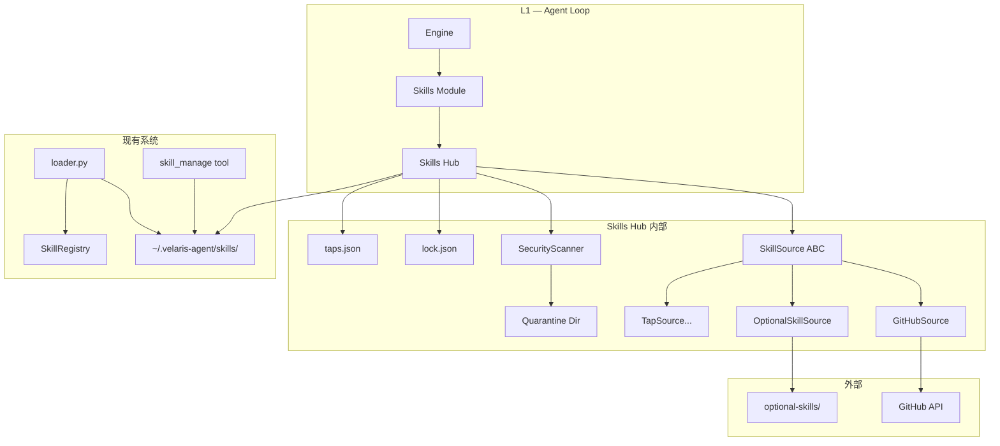
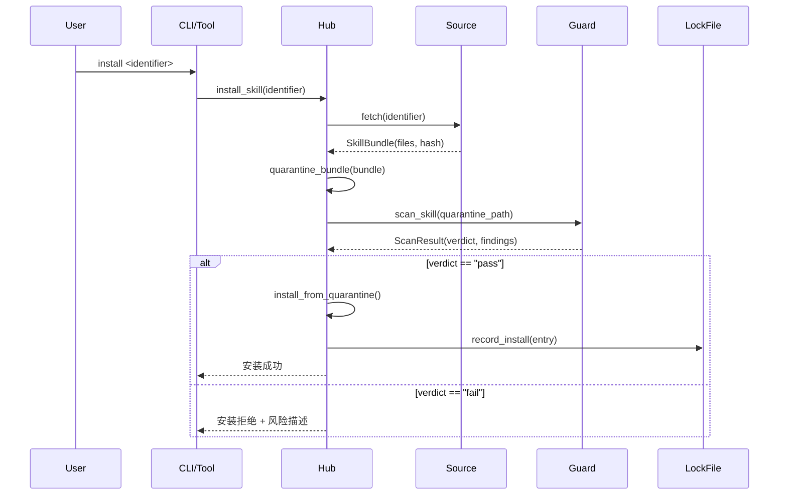
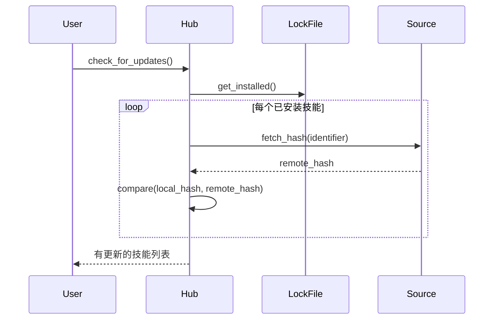

# 设计文档：Skills Hub 与技能自更新

## 概述

本设计为 velaris-agent 引入完整的 Skills Hub 系统，实现技能的多源发现、安全安装、基于内容哈希的自动更新检测、锁文件溯源追踪，以及 CLI 命令行管理。核心代码从 hermes-agent 移植并适配 velaris-agent 的现有架构。

### 设计目标

1. 从 hermes-agent 移植 Skills Hub 核心逻辑，适配 velaris-agent 路径和数据模型
2. 保持与现有 `SkillRegistry`、`skill_manage` 工具、`build_skills_system_prompt()` 的完全兼容
3. 安装流程强制经过隔离 + 安全扫描，确保技能内容安全
4. 提供 CLI 和 Agent Tool 两种管理入口
5. 新增 skill-creator 内置技能，引导用户创建规范技能

### 代码移植策略

从 hermes-agent 移植的代码按以下规则适配：

| hermes-agent 原始代码　　　　　　　　| velaris-agent 目标　　　　　　　　　　　　　| 适配要点　　　　　　　　　　　　　　　　 |
| --------------------------------------| ---------------------------------------------| ------------------------------------------|
| `tools/skills_hub.py` (3053行)　　　 | `src/openharness/skills/hub.py` + `lock.py` | 拆分为 Hub 操作和 Lock/Taps 管理两个模块 |
| `tools/skills_guard.py`　　　　　　　| `src/openharness/skills/guard.py`　　　　　 | 直接移植，调整 import 路径　　　　　　　 |
| `hermes_cli/skills_hub.py`　　　　　 | `src/openharness/commands/skills_cli.py`　　| 适配 Typer CLI 框架　　　　　　　　　　　|
| `hermes_constants.get_hermes_home()` | `openharness.config.paths.get_config_dir()` | 全局替换路径函数　　　　　　　　　　　　 |
| `HERMES_HOME / "skills"`　　　　　　 | `get_user_skills_dir()`　　　　　　　　　　 | 复用 loader.py 已有函数　　　　　　　　　|
| `httpx` 依赖　　　　　　　　　　　　 | 已在 pyproject.toml 中 (`httpx>=0.27.0`)　　| 无需额外添加　　　　　　　　　　　　　　 |

## 架构

### 整体架构



### 安装流程



### 更新检测流程




## 组件与接口

### 1. 技能来源抽象层 (`hub.py`)

#### SkillMeta — 技能元数据

从 hermes-agent `SkillMeta` dataclass 移植，适配为 Pydantic model：

```python
class SkillMeta(BaseModel):
    """技能搜索结果元数据。"""
    name: str
    description: str
    source: str           # "github", "optional", "tap:<repo>"
    identifier: str       # 唯一标识，如 "owner/repo/path"
    trust_level: str      # "builtin" | "trusted" | "community"
    repo: str | None = None
    path: str | None = None
    tags: list[str] = []
```

#### SkillBundle — 技能文件包

```python
class SkillBundle(BaseModel):
    """从来源获取的完整技能文件包。"""
    name: str
    files: dict[str, str]   # relative_path -> content
    source: str
    identifier: str
    trust_level: str
    content_hash: str        # SHA-256 of all files
    metadata: dict[str, Any] = {}
```

#### SkillSource ABC

从 hermes-agent 移植，保持接口一致：

```python
class SkillSource(ABC):
    """技能来源适配器抽象基类。"""

    @abstractmethod
    async def search(self, query: str) -> list[SkillMeta]: ...

    @abstractmethod
    async def fetch(self, identifier: str) -> SkillBundle: ...

    @abstractmethod
    def source_id(self) -> str: ...

    @abstractmethod
    def trust_level_for(self, identifier: str) -> str: ...
```

#### GitHubSource

从 hermes-agent `GitHubSource` 移植，关键适配：
- 使用 `httpx.AsyncClient` 替代同步 httpx（已在依赖中）
- 认证链：PAT 环境变量 → `gh auth token` CLI → 匿名
- 搜索：通过 GitHub Contents API 扫描仓库中的 `SKILL.md` 文件
- 获取：通过 Git Tree API 获取完整技能目录

```python
class GitHubAuth:
    """GitHub 认证链。"""
    async def get_token(self) -> str | None: ...

class GitHubSource(SkillSource):
    """GitHub 仓库技能来源。"""
    def __init__(self, repo: str, auth: GitHubAuth | None = None): ...
    async def search(self, query: str) -> list[SkillMeta]: ...
    async def fetch(self, identifier: str) -> SkillBundle: ...
```

#### OptionalSkillSource

扫描本地 `optional-skills/` 目录（项目内可选技能）：

```python
class OptionalSkillSource(SkillSource):
    """本地可选技能来源。"""
    def __init__(self, base_dir: Path): ...
```

### 2. 安全扫描器 (`guard.py`)

从 hermes-agent `skills_guard.py` 完整移植：

```python
@dataclass
class Finding:
    """单个安全发现项。"""
    pattern_id: str
    severity: str       # "high" | "medium" | "low"
    category: str       # "exfiltration" | "injection" | "destructive" | ...
    file: str
    line: int
    match: str
    description: str

@dataclass
class ScanResult:
    """技能安全扫描结果。"""
    skill_name: str
    source: str
    trust_level: str
    verdict: str        # "pass" | "fail" | "warn"
    findings: list[Finding]
    scanned_at: str
    summary: str

# 核心函数
def scan_file(path: Path, patterns: list[ThreatPattern]) -> list[Finding]: ...
def scan_skill(skill_dir: Path, skill_name: str, source: str, trust_level: str) -> ScanResult: ...
def should_allow_install(scan_result: ScanResult) -> tuple[bool, str]: ...
```

移植的威胁模式（~80 条正则）覆盖：
- 数据外泄（exfiltration）
- 命令注入（injection）
- 破坏性操作（destructive）
- 持久化后门（persistence）
- 网络访问（network）
- 代码混淆（obfuscation）
- 路径穿越（traversal）
- 挖矿（mining）
- 供应链攻击（supply_chain）
- 权限提升（privilege_escalation）
- 凭证暴露（credential_exposure）

结构性检查：
- 文件数量限制
- 单文件大小限制
- 二进制文件检测
- 符号链接逃逸检测
- 不可见 Unicode 字符检测

### 3. 锁文件与 Taps 管理 (`lock.py`)

#### HubLockFile

从 hermes-agent `HubLockFile` 移植，路径适配为 `~/.velaris-agent/skills/lock.json`：

```python
class LockEntry(BaseModel):
    """锁文件中单个技能的记录。"""
    name: str
    source: str
    identifier: str
    trust_level: str
    content_hash: str
    install_path: str
    files: list[str]
    installed_at: str
    updated_at: str | None = None

class HubLockFile:
    """Hub 锁文件管理。"""
    def __init__(self, lock_path: Path | None = None): ...
    def load(self) -> dict[str, LockEntry]: ...
    def save(self, entries: dict[str, LockEntry]) -> None: ...
    def record_install(self, entry: LockEntry) -> None: ...
    def record_uninstall(self, name: str) -> None: ...
    def get_installed(self, name: str) -> LockEntry | None: ...
    def list_installed(self) -> list[LockEntry]: ...
```

原子写入实现：先写临时文件，再 `os.replace()` 覆盖。

#### TapsManager

```python
class TapsManager:
    """自定义 Tap 来源管理。"""
    def __init__(self, taps_path: Path | None = None): ...
    def load(self) -> list[dict[str, str]]: ...
    def save(self, taps: list[dict[str, str]]) -> None: ...
    def add(self, repo: str) -> None: ...
    def remove(self, repo: str) -> None: ...
    def list_taps(self) -> list[dict[str, str]]: ...
```

### 4. Hub 操作函数 (`hub.py`)

从 hermes-agent 移植的核心操作函数：

```python
# 目录管理
def ensure_hub_dirs() -> tuple[Path, Path]:
    """确保 quarantine/ 和 audit/ 目录存在。"""

# 安装流程
async def quarantine_bundle(bundle: SkillBundle) -> Path:
    """将技能包写入隔离目录。"""

def install_from_quarantine(quarantine_path: Path, target_dir: Path) -> Path:
    """从隔离区安装到用户技能目录。"""

async def install_skill(identifier: str, *, force: bool = False) -> str:
    """完整安装流程：fetch → quarantine → scan → install → record。"""

def uninstall_skill(name: str) -> str:
    """卸载技能并清理锁文件记录。"""

# 更新检测
async def check_for_skill_updates() -> list[dict[str, Any]]:
    """检查所有已安装技能的可用更新。"""

async def update_skill(name: str) -> str:
    """更新指定技能。"""

# 搜索
async def parallel_search_sources(query: str, sources: list[SkillSource]) -> list[SkillMeta]:
    """并行搜索所有来源并合并去重。"""

# 路径验证（从 hermes-agent 移植）
def _validate_skill_name(name: str) -> None: ...
def _validate_bundle_rel_path(rel_path: str) -> None: ...
def _normalize_bundle_path(rel_path: str) -> str: ...

# 内容哈希
def content_hash(content: str) -> str:
    """计算单个文件的 SHA-256 哈希。"""

def bundle_content_hash(files: dict[str, str]) -> str:
    """计算技能包所有文件的组合哈希。"""

# 审计日志
def append_audit_log(action: str, skill_name: str, details: dict[str, Any]) -> None:
    """追加审计日志条目。"""
```

### 5. Agent Tool (`skills_hub_tool.py`)

新增 Agent 工具，包装 Hub 操作供 LLM 调用：

```python
class SkillsHubInput(BaseModel):
    action: str = Field(description="操作：search/install/check/update/uninstall/audit")
    query: str | None = Field(default=None, description="搜索关键词")
    name: str | None = Field(default=None, description="技能名称或标识符")
    force: bool = Field(default=False, description="是否强制安装/更新")

class SkillsHubTool(BaseTool):
    name = "skills_hub"
    description = "Search, install, update, and manage skills from Skills Hub."
    input_model = SkillsHubInput
```

### 6. CLI 命令 (`skills_cli.py`)

使用 Typer 框架，注册为 `velaris skills` 子命令组：

```python
skills_app = typer.Typer(name="skills", help="Skills Hub 管理")

@skills_app.command("search")
def do_search(query: str): ...

@skills_app.command("install")
def do_install(identifier: str): ...

@skills_app.command("check")
def do_check(name: str | None = None): ...

@skills_app.command("update")
def do_update(name: str | None = None): ...

@skills_app.command("uninstall")
def do_uninstall(name: str): ...

@skills_app.command("list")
def do_list(): ...

@skills_app.command("audit")
def do_audit(name: str | None = None): ...

# Tap 子命令组
tap_app = typer.Typer(name="tap", help="管理自定义 Tap 来源")

@tap_app.command("add")
def tap_add(repo: str): ...

@tap_app.command("remove")
def tap_remove(repo: str): ...

@tap_app.command("list")
def tap_list(): ...
```

### 7. Skill Creator 内置技能

在 `src/openharness/skills/bundled/content/skill-creator.md` 添加内置技能。

该技能从 `FrancyJGLisboa/agent-skill-creator` 适配，关键调整：
- 移除跨平台安装逻辑（velaris-agent 专用）
- 集成现有 `skill_manage` 工具
- 使用 velaris-agent 路径约定
- 5 阶段引导流程：发现 → 设计 → 架构 → 检测 → 实现

### 8. 架构图更新

更新 `docs/diagrams/velaris-architecture.svg`，在 L1 层新增 Skills Hub 组件：
- 在 Skills 模块旁添加 Skills Hub 节点
- 添加 Skills Hub → GitHub / Taps 的外部数据流箭头
- 添加 Lock File 和 Quarantine Dir 关联存储标注
- 保持 Style-1 Flat Icon 视觉风格一致


## 数据模型

### Lock File 格式 (`lock.json`)

```json
{
  "version": 1,
  "skills": {
    "my-skill": {
      "name": "my-skill",
      "source": "github",
      "identifier": "owner/repo/skills/my-skill",
      "trust_level": "community",
      "content_hash": "sha256:abc123...",
      "install_path": "~/.velaris-agent/skills/my-skill",
      "files": [
        "SKILL.md",
        "references/api.md",
        "scripts/validate.py"
      ],
      "installed_at": "2025-01-15T10:30:00Z",
      "updated_at": null
    }
  }
}
```

### Taps 配置格式 (`taps.json`)

```json
{
  "version": 1,
  "taps": [
    {
      "repo": "myorg/my-skills-repo",
      "added_at": "2025-01-15T10:30:00Z"
    }
  ]
}
```

### 审计日志格式 (`audit.log`)

每行一条 JSON 记录：

```json
{"timestamp": "2025-01-15T10:30:00Z", "action": "install", "skill": "my-skill", "source": "github", "identifier": "owner/repo/skills/my-skill", "verdict": "pass", "findings_count": 0}
```

### 安全扫描报告格式

```python
@dataclass
class ScanResult:
    skill_name: str
    source: str
    trust_level: str
    verdict: str          # "pass" | "fail" | "warn"
    findings: list[Finding]
    scanned_at: str       # ISO 8601
    summary: str          # 人类可读摘要
```

### 与现有数据模型的关系

- `SkillBundle.files` 安装后成为 `~/.velaris-agent/skills/<slug>/` 下的文件
- 安装完成后，`load_user_skills()` 通过 `_iter_user_skill_files()` 自动发现 `SKILL.md`
- `SkillDefinition` 不变，Hub 安装的技能与手动创建的技能在注册表中无差异
- `LockEntry` 仅追踪 Hub 安装的技能，手动创建的技能不在 lock.json 中

### 文件系统布局

```
~/.velaris-agent/
├── skills/
│   ├── lock.json              # Hub 锁文件
│   ├── my-hub-skill/          # Hub 安装的技能
│   │   ├── SKILL.md
│   │   └── references/
│   ├── my-manual-skill/       # 手动创建的技能（不在 lock.json 中）
│   │   └── SKILL.md
│   └── .quarantine/           # 隔离目录（临时）
│       └── pending-skill/
├── taps.json                  # Tap 来源配置
├── audit/
│   └── skills-audit.log       # 审计日志
└── ...
```


## 正确性属性

*属性（Property）是系统在所有合法执行中都应保持为真的特征或行为——本质上是对系统应做什么的形式化陈述。属性是人类可读规格说明与机器可验证正确性保证之间的桥梁。*

### Property 1: 搜索结果去重

*For any* 一组 SkillSource 返回的搜索结果（可能包含重复 identifier），经过 `parallel_search_sources()` 合并后，结果列表中不应存在两个具有相同 identifier 的 SkillMeta。

**Validates: Requirements 1.3**

### Property 2: 内容哈希一致性

*For any* SkillBundle，其 `content_hash` 字段应等于对 `files` 字典重新计算 `bundle_content_hash()` 的结果。即 `bundle.content_hash == bundle_content_hash(bundle.files)`。

**Validates: Requirements 1.4**

### Property 3: 来源故障容错

*For any* 一组 SkillSource，其中部分来源抛出异常，`parallel_search_sources()` 应仍然返回所有未出错来源的结果，且不抛出异常。同理，`check_for_skill_updates()` 在部分来源不可达时应继续检查其余技能。

**Validates: Requirements 1.5, 3.6**

### Property 4: 威胁模式检测

*For any* 文件内容包含已知高危威胁模式（如 shell 注入、路径穿越），`scan_file()` 应返回至少一个 severity 为 "high" 的 Finding，且 `scan_skill()` 的 verdict 应为 "fail"。

**Validates: Requirements 2.4, 7.1, 7.4**

### Property 5: 安装后锁文件完整性

*For any* 成功安装的技能，Lock_File 中应存在对应的 LockEntry，且该 entry 包含所有必填字段（name、source、identifier、trust_level、content_hash、install_path、files、installed_at），且 content_hash 与安装时的 bundle hash 一致。

**Validates: Requirements 2.5, 4.2**

### Property 6: 重复安装拒绝

*For any* 已存在于 Lock_File 中的技能名，在 `force=False` 时调用 `install_skill()` 应返回错误，且 Lock_File 内容不变。

**Validates: Requirements 2.6**

### Property 7: 哈希变更检测

*For any* 已安装技能，当本地 content_hash 与上游 content_hash 不同时，`check_for_skill_updates()` 应将该技能标记为有可用更新；当两者相同时，不应标记。

**Validates: Requirements 3.3**

### Property 8: 更新后锁文件刷新

*For any* 成功更新的技能，Lock_File 中对应 entry 的 content_hash 应更新为新值，且 updated_at 字段应为非空的有效时间戳。

**Validates: Requirements 3.5**

### Property 9: 卸载清理

*For any* 已安装技能，卸载后 Lock_File 中不应再包含该技能的记录。

**Validates: Requirements 4.3**

### Property 10: Tap 移除

*For any* 已注册的 Tap，移除后 `list_taps()` 返回的列表中不应包含该 Tap 的 repo。

**Validates: Requirements 5.3**

### Property 11: Tap 地址格式验证

*For any* 不符合 `owner/repo` 格式的字符串（如空字符串、缺少 `/`、包含空格或特殊字符），`TapsManager.add()` 应拒绝添加并返回错误。

**Validates: Requirements 5.5**

### Property 12: 扫描报告结构完整性

*For any* 技能目录的扫描结果，`ScanResult` 应包含所有必填字段（skill_name、source、trust_level、verdict、findings、scanned_at、summary），且 verdict 为 "pass"、"fail" 或 "warn" 之一。

**Validates: Requirements 7.2**

### Property 13: 审计日志追加

*For any* 安装或卸载操作，审计日志文件应新增一条包含 action、skill name 和 timestamp 的记录。

**Validates: Requirements 7.5**

### Property 14: Hub 安装技能可被注册表发现

*For any* 通过 Hub 安装到 `~/.velaris-agent/skills/<slug>/SKILL.md` 的技能，`load_skill_registry()` 应能发现并返回该技能。

**Validates: Requirements 11.2**

### Property 15: 手动技能不影响锁文件

*For any* 通过 `skill_manage` 手动创建的技能（直接写入用户技能目录），Lock_File 的内容不应发生变化。

**Validates: Requirements 11.4**

### Property 16: Lock File 序列化往返一致性

*For any* 合法的 Lock_File 数据对象（包含任意数量的 LockEntry），执行 `save()` 后再 `load()` 应产生等价的数据对象。

**Validates: Requirements 12.2**

### Property 17: 无效 JSON 解析错误处理

*For any* 非法 JSON 字符串作为 Lock_File 内容，`HubLockFile.load()` 应返回空状态（空字典）而非抛出未处理异常，并记录警告。

**Validates: Requirements 12.3, 4.5**


## 错误处理

### 网络错误

| 场景 | 处理方式 |
|---|---|
| GitHub API 请求超时 | 记录警告日志，跳过该来源，返回其他来源结果 |
| GitHub API 返回 403/429 | 记录速率限制警告，建议用户配置 PAT |
| GitHub API 返回 404 | 标记该来源/技能不存在，继续处理 |
| Tap 仓库不可达 | 记录错误，跳过该 Tap，继续搜索其他来源 |

### 文件系统错误

| 场景 | 处理方式 |
|---|---|
| Lock_File 不存在 | 创建空锁文件，记录 info 日志 |
| Lock_File JSON 损坏 | 备份损坏文件，创建新空锁文件，记录 warning |
| taps.json 不存在 | 创建空 taps 配置 |
| 隔离目录写入失败 | 返回安装失败错误，清理临时文件 |
| 目标技能目录权限不足 | 返回权限错误，建议检查目录权限 |

### 安全扫描错误

| 场景 | 处理方式 |
|---|---|
| 扫描发现高危模式 | verdict="fail"，拒绝安装，返回详细 findings |
| 扫描发现中危模式 | verdict="warn"，提示用户确认 |
| 文件过大无法扫描 | 标记为 finding（structural check），建议人工审查 |
| 二进制文件检测 | 标记为 finding，阻止安装 |

### 安装流程错误

| 场景 | 处理方式 |
|---|---|
| 技能已存在且未指定 force | 返回错误，提示使用 update 命令 |
| 技能名称不合法 | 返回验证错误，说明命名规则 |
| Bundle 路径穿越尝试 | 拒绝安装，记录安全审计日志 |
| 安装中途失败 | 清理隔离目录和部分安装文件，不写入锁文件 |

## 测试策略

### 双轨测试方法

本功能采用单元测试 + 属性测试的双轨策略：

- **单元测试**：验证具体示例、边界情况和错误条件
- **属性测试**：验证跨所有输入的通用属性

两者互补，缺一不可。

### 属性测试配置

- **库选择**：使用 [Hypothesis](https://hypothesis.readthedocs.io/) 作为 Python 属性测试库
- **最小迭代次数**：每个属性测试至少运行 100 次
- **标签格式**：每个测试用注释引用设计文档中的属性编号
  - 格式：`# Feature: skill-self-update, Property {N}: {property_text}`
- **每个正确性属性由单个属性测试实现**

### 属性测试覆盖

| 属性 | 测试文件 | 生成器策略 |
|---|---|---|
| Property 1: 搜索结果去重 | `tests/test_hub_properties.py` | 生成随机 SkillMeta 列表，部分 identifier 重复 |
| Property 2: 内容哈希一致性 | `tests/test_hub_properties.py` | 生成随机 files 字典（路径→内容） |
| Property 3: 来源故障容错 | `tests/test_hub_properties.py` | 生成随机来源列表，随机标记部分为失败 |
| Property 4: 威胁模式检测 | `tests/test_guard_properties.py` | 生成随机文件内容，注入已知威胁模式 |
| Property 5: 安装后锁文件完整性 | `tests/test_lock_properties.py` | 生成随机 LockEntry |
| Property 6: 重复安装拒绝 | `tests/test_hub_properties.py` | 生成随机已安装技能名 |
| Property 7: 哈希变更检测 | `tests/test_hub_properties.py` | 生成随机哈希对（相同/不同） |
| Property 8: 更新后锁文件刷新 | `tests/test_lock_properties.py` | 生成随机 LockEntry + 新哈希 |
| Property 9: 卸载清理 | `tests/test_lock_properties.py` | 生成随机已安装技能列表 |
| Property 10: Tap 移除 | `tests/test_lock_properties.py` | 生成随机 Tap 列表 |
| Property 11: Tap 地址格式验证 | `tests/test_lock_properties.py` | 生成随机无效字符串 |
| Property 12: 扫描报告结构完整性 | `tests/test_guard_properties.py` | 生成随机技能目录结构 |
| Property 13: 审计日志追加 | `tests/test_hub_properties.py` | 生成随机操作序列 |
| Property 14: Hub 安装技能可被注册表发现 | `tests/test_integration_properties.py` | 生成随机 SKILL.md 内容 |
| Property 15: 手动技能不影响锁文件 | `tests/test_integration_properties.py` | 生成随机手动技能 |
| Property 16: Lock File 往返一致性 | `tests/test_lock_properties.py` | 生成随机 LockEntry 字典 |
| Property 17: 无效 JSON 错误处理 | `tests/test_lock_properties.py` | 生成随机非法 JSON 字符串 |

### 单元测试覆盖

| 测试文件　　　　　　　　　　　　| 覆盖范围　　　　　　　　　　　　　　　　　　　　　　　　　　|
| ---------------------------------| -------------------------------------------------------------|
| `tests/test_hub.py`　　　　　　 | Hub 操作函数：install、uninstall、update、search 的具体示例 |
| `tests/test_guard.py`　　　　　 | 安全扫描器：具体威胁模式匹配、结构性检查、边界情况　　　　　|
| `tests/test_lock.py`　　　　　　| 锁文件：load/save 具体示例、损坏文件恢复、原子写入　　　　　|
| `tests/test_skills_hub_tool.py` | Agent Tool：各 action 的输入输出验证　　　　　　　　　　　　|
| `tests/test_skills_cli.py`　　　| CLI 命令：命令注册、参数解析、输出格式　　　　　　　　　　　|
| `tests/test_skill_creator.py`　 | skill-creator 内置技能：frontmatter 解析、注册表发现　　　　|

### 边界情况测试

- Lock_File 为空文件 / 不存在 / 格式损坏
- taps.json 为空文件 / 不存在
- 技能名包含特殊字符 / Unicode
- 技能文件包含不可见 Unicode 字符
- 技能包包含符号链接逃逸
- 技能包包含二进制文件
- 技能包文件数量超限
- 单文件大小超限
- 并发安装同一技能
- GitHub API 返回空结果
- 搜索查询为空字符串
