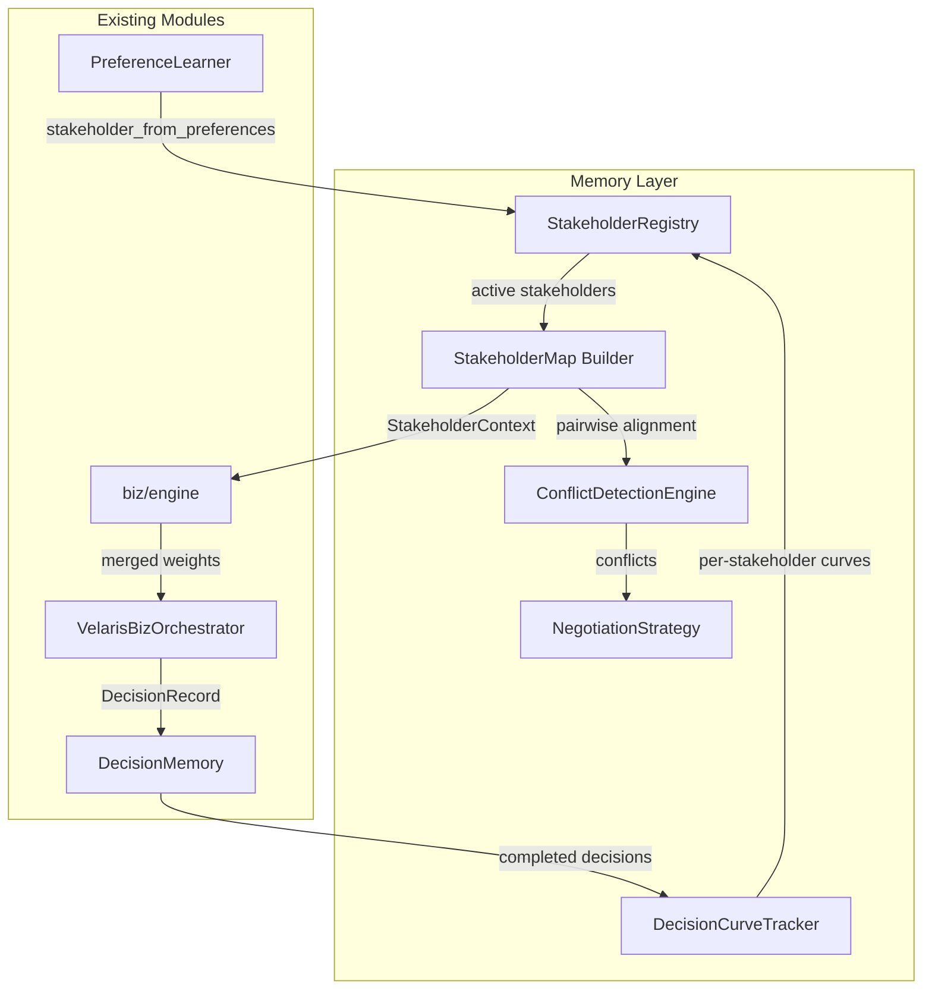
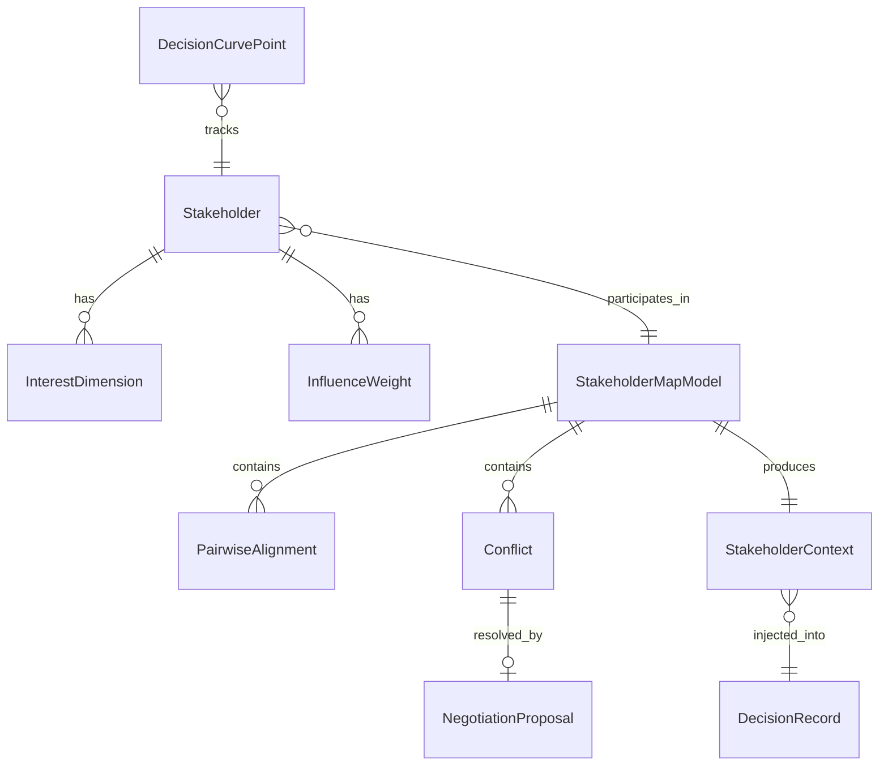

# Design Document: Stakeholder Mapping

## Overview

This design extends the Velaris decision intelligence engine with explicit Stakeholder modeling. Today, the system has implicit two-party alignment (user ↔ org) via `PreferenceLearner.compute_alignment()` and `AlignmentReport`. This upgrade promotes stakeholders to first-class entities with their own goals, influence weights, and interest dimensions, enabling multi-party conflict detection, negotiation strategy generation, and per-stakeholder decision curve tracking.

The design adds four new modules under `src/velaris_agent/memory/`:

| Module | Responsibility |
|--------|---------------|
| `stakeholder.py` | `Stakeholder` data model, `StakeholderRegistry` CRUD + validation |
| `stakeholder_map.py` | `StakeholderMap` construction, pairwise alignment, `AlignmentMatrix` |
| `conflict_engine.py` | `ConflictDetectionEngine` — dimension-level and weight-level conflict detection, severity scoring |
| `negotiation.py` | `NegotiationStrategy` — compromise proposals, feasibility scoring, hard-constraint handling |

Integration touch-points (existing files, additive changes only):

| File | Change |
|------|--------|
| `memory/types.py` | Add new Pydantic models (`Stakeholder`, `InterestDimension`, `StakeholderMap`, `Conflict`, `NegotiationProposal`, etc.) |
| `memory/preference_learner.py` | Add `stakeholder_from_preferences()` and `stakeholder_from_org_policy()` factory helpers; keep existing `compute_alignment()` signature unchanged |
| `biz/engine.py` | Add optional `stakeholder_map` parameter to `build_capability_plan()` and `score_options()` for weight injection |
| `memory/decision_memory.py` | No changes — `DecisionRecord.env_snapshot` already accepts arbitrary dict keys |

All new code is pure Python with Pydantic v2 models. No new external dependencies.

## Architecture



**Data flow for a single decision:**

1. `StakeholderRegistry.list_active(scenario)` → all active stakeholders
2. `StakeholderMap.build(scenario, registry)` → pairwise alignment matrix
3. `ConflictDetectionEngine.detect(stakeholder_map)` → sorted conflicts
4. `NegotiationStrategy.generate(conflicts, stakeholder_map)` → proposals
5. Engine merges stakeholder influence weights into `score_options()` weights
6. `DecisionRecord.env_snapshot["stakeholder_context"]` captures the full context
7. After decision, `DecisionCurveTracker.update(decision_record, stakeholder_map)` updates per-stakeholder curves

## Components and Interfaces

### 1. Data Models (in `memory/types.py`)

```python
class PreferenceDirection(str, Enum):
    HIGHER_IS_BETTER = "higher_is_better"
    LOWER_IS_BETTER = "lower_is_better"

class StakeholderRole(str, Enum):
    USER = "user"
    ORG = "org"
    RELATIONSHIP = "relationship"

class InterestDimension(BaseModel):
    dimension: str                          # e.g. "cost", "growth"
    direction: PreferenceDirection
    weight: float = Field(ge=0.0, le=1.0)

class Stakeholder(BaseModel):
    stakeholder_id: str
    role: StakeholderRole
    display_name: str
    scenario: str
    interest_dimensions: list[InterestDimension]
    influence_weights: dict[str, float]     # dimension → influence 0..1
    related_stakeholder_ids: list[str] = []  # required len==2 when role==relationship
    active: bool = True
    version: int = 1
    created_at: datetime | None = None
    updated_at: datetime | None = None

class PairwiseAlignment(BaseModel):
    stakeholder_a_id: str
    stakeholder_b_id: str
    score: float = Field(ge=0.0, le=1.0)
    classification: str  # "aligned" | "neutral" | "conflicting"

class Conflict(BaseModel):
    stakeholder_a_id: str
    stakeholder_b_id: str
    dimension: str
    conflict_type: str  # "direction" | "weight"
    severity: float = Field(ge=0.0, le=1.0)
    details: dict[str, Any] = {}

class NegotiationProposal(BaseModel):
    dimension: str
    compromise_weight: float
    concessions: dict[str, float]  # stakeholder_id → concession amount
    feasibility: float = Field(ge=0.0, le=1.0)
    non_negotiable: bool = False

class StakeholderContext(BaseModel):
    """Injected into DecisionRecord.env_snapshot."""
    scenario: str
    stakeholder_ids: list[str]
    alignment_matrix: list[PairwiseAlignment]
    conflicts: list[Conflict]
    negotiation_proposals: list[NegotiationProposal]
    warnings: list[str] = []

class StakeholderMapModel(BaseModel):
    """Serializable representation of a full stakeholder map."""
    map_id: str
    scenario: str
    stakeholders: list[Stakeholder]
    alignment_matrix: list[PairwiseAlignment]
    conflicts: list[Conflict]
    timestamp: datetime
```

### 2. StakeholderRegistry (`memory/stakeholder.py`)

```python
class StakeholderRegistry:
    def __init__(self) -> None: ...

    # CRUD
    def register(self, stakeholder: Stakeholder) -> str: ...
    def get(self, stakeholder_id: str, scenario: str) -> Stakeholder | None: ...
    def update(self, stakeholder_id: str, scenario: str, **fields) -> Stakeholder: ...
    def remove(self, stakeholder_id: str, scenario: str) -> None: ...
    def list_active(self, scenario: str, role: StakeholderRole | None = None) -> list[Stakeholder]: ...

    # Validation
    def _validate_stakeholder(self, s: Stakeholder) -> None: ...
    def _check_duplicate(self, s: Stakeholder) -> None: ...
    def _check_relationship_refs(self, s: Stakeholder) -> None: ...
    def _check_in_use(self, stakeholder_id: str, scenario: str) -> None: ...

    # Migration helpers
    def from_user_preferences(self, prefs: UserPreferences) -> Stakeholder: ...
    def from_org_policy(self, policy: OrgPolicy) -> Stakeholder: ...
```

**Key behaviors:**
- `register()` validates all fields, checks for duplicate id+scenario, persists, returns id.
- `update()` merges fields, increments `version`.
- `remove()` sets `active=False`; raises error if stakeholder is referenced by an active `StakeholderMap`.
- `from_user_preferences()` maps `UserPreferences.weights` → `InterestDimension` list (all `higher_is_better`), and `confidence` → uniform influence weight.
- `from_org_policy()` maps `OrgPolicy.weights` → `InterestDimension` list, `constraints` keys → non-negotiable dimensions.

**Storage:** In-memory dict keyed by `(stakeholder_id, scenario)`. Consistent with `OutcomeStore` and `TaskLedger` patterns in the codebase.

### 3. StakeholderMap Builder (`memory/stakeholder_map.py`)

```python
class StakeholderMapBuilder:
    def __init__(self, registry: StakeholderRegistry) -> None: ...

    def build(self, scenario: str) -> StakeholderMapModel: ...
    def compute_pairwise_alignment(self, a: Stakeholder, b: Stakeholder) -> PairwiseAlignment: ...
    def export_as_alignment_report(self, map_model: StakeholderMapModel, user_id: str, org_id: str) -> AlignmentReport: ...
```

**Pairwise alignment algorithm:**

```
For stakeholders A and B:
  shared_dims = intersection of A.interest_dimensions and B.interest_dimensions
  if no shared_dims: score = 0.5 (neutral)
  else:
    for each shared dim:
      direction_match = 1.0 if same direction else 0.0
      weight_similarity = 1.0 - abs(A.weight - B.weight)
      influence_factor = (A.influence[dim] + B.influence[dim]) / 2
      dim_score = direction_match * 0.6 + weight_similarity * 0.4
      weighted_dim_score = dim_score * influence_factor
    score = sum(weighted_dim_scores) / sum(influence_factors)

  classification:
    score >= 0.7 → "aligned"
    0.3 <= score < 0.7 → "neutral"
    score < 0.3 → "conflicting"
```

**Edge case:** Fewer than 2 stakeholders → return valid map with empty alignment matrix and no conflicts.

**Backward compatibility:** `export_as_alignment_report()` extracts a two-party subset and returns the existing `AlignmentReport` format.

### 4. ConflictDetectionEngine (`memory/conflict_engine.py`)

```python
class ConflictDetectionEngine:
    def detect(self, map_model: StakeholderMapModel) -> list[Conflict]: ...
```

**Two conflict types:**

1. **Direction conflict:** Two stakeholders have opposite `PreferenceDirection` on the same dimension.
   - Severity = `influence_A[dim] * influence_B[dim]` (product of influence weights).

2. **Weight conflict:** Two stakeholders assign weights differing by > 0.3 on the same dimension, same direction.
   - Severity = `influence_A[dim] * influence_B[dim] * abs(weight_A - weight_B)`.

Returns conflicts sorted by severity descending. Empty list + summary string when no conflicts found.

### 5. NegotiationStrategy (`memory/negotiation.py`)

```python
class NegotiationStrategy:
    def generate(
        self,
        conflicts: list[Conflict],
        map_model: StakeholderMapModel,
        org_policy: OrgPolicy | None = None,
    ) -> list[NegotiationProposal]: ...
```

**Concession formula:**

For a conflicting dimension with stakeholders A and B:
```
total_inverse_influence = (1 / influence_A) + (1 / influence_B)
concession_A = (1 / influence_A) / total_inverse_influence * total_gap
concession_B = (1 / influence_B) / total_inverse_influence * total_gap
compromise_weight = clamp(midpoint adjusted by concessions, min_weight, max_weight)
```

Lower influence → larger concession (proportional to inverse influence).

**Feasibility score:** `1.0 - (total_concession / max_possible_concession)`, clamped to [0, 1].

**Hard constraints:** If `OrgPolicy.constraints` marks a dimension, that dimension is `non_negotiable=True` and the constraint holder's concession is 0.

### 6. Decision Flow Integration

**In `biz/engine.py`:**

```python
def build_capability_plan(
    query: str,
    constraints: dict[str, Any] | None = None,
    scenario: str | None = None,
    stakeholder_map: StakeholderMapModel | None = None,  # NEW optional param
) -> dict[str, Any]:
    ...
    # If stakeholder_map provided, merge influence weights into decision_weights
    if stakeholder_map:
        plan["stakeholder_context"] = _build_stakeholder_context(stakeholder_map)
        plan["decision_weights"] = _merge_stakeholder_weights(
            plan["decision_weights"], stakeholder_map
        )
    return plan
```

The merge algorithm averages stakeholder influence weights with existing scenario weights, preserving the existing behavior when no stakeholder map is provided.

**Warning injection:** When `StakeholderContext.conflicts` contains items with `severity > 0.5`, append warning strings to `DecisionRecord.explanation`.

**Fallback (Req 6.5):** If no `StakeholderMap` exists, the engine proceeds with existing logic unchanged.

### 7. DecisionCurveTracker

Extends the existing `DecisionCurvePoint` model:

```python
class DecisionCurveTracker:
    def __init__(self, memory: DecisionMemory, registry: StakeholderRegistry) -> None: ...

    def update(self, record: DecisionRecord, map_model: StakeholderMapModel) -> None: ...
    def get_curve(self, stakeholder_id: str, scenario: str, window_days: int = 30) -> list[DecisionCurvePoint]: ...
    def detect_trends(self, stakeholder_a_id: str, stakeholder_b_id: str, scenario: str) -> str: ...
```

**Per-stakeholder metrics:** decision_count, acceptance_rate, bias_count, weight_stability (computed as `1 - stddev(recent_weights)`).

**Trend detection:** Compare alignment scores across 3 consecutive periods. Increasing → "convergence", decreasing → "divergence", otherwise → "stable".

### 8. Serialization

`StakeholderMapModel` is a Pydantic v2 `BaseModel`. Serialization/deserialization uses:

```python
# Serialize
json_str = map_model.model_dump_json(indent=2)

# Deserialize
restored = StakeholderMapModel.model_validate_json(json_str)
```

Round-trip property: `model_validate_json(model.model_dump_json()).model_dump_json() == model.model_dump_json()`.

Error handling for missing/invalid fields is provided by Pydantic's `ValidationError`, which lists all missing fields and type mismatches.

### 9. Backward Compatibility

| Concern | Solution |
|---------|----------|
| Existing `compute_alignment(user_id, org_policy)` signature | Unchanged. Internally may delegate to new stakeholder map but returns same `AlignmentReport` |
| Old `DecisionRecord` without `stakeholder_context` in `env_snapshot` | Parser reads `env_snapshot.get("stakeholder_context")` — `None` is valid, no error |
| `build_capability_plan()` without `stakeholder_map` | New param is `Optional`, default `None`, existing callers unaffected |
| `StakeholderMapModel.export_as_alignment_report()` | Produces standard `AlignmentReport` for any two-party subset |

## Data Models

All models are Pydantic v2 `BaseModel` subclasses defined in `memory/types.py`, consistent with existing `DecisionRecord`, `AlignmentReport`, etc.

**Entity Relationship:**



**Key constraints:**
- `Stakeholder.stakeholder_id` + `scenario` is unique within the registry
- `role == "relationship"` requires `len(related_stakeholder_ids) == 2`
- `InterestDimension.weight` ∈ [0.0, 1.0]
- `Stakeholder.influence_weights` values ∈ [0.0, 1.0] per dimension
- `PairwiseAlignment.classification` derived from score thresholds (0.3, 0.7)
- `Conflict.severity` ∈ [0.0, 1.0]
- `NegotiationProposal.compromise_weight` ∈ [min_weight, max_weight] of conflicting parties


## Correctness Properties

*A property is a characteristic or behavior that should hold true across all valid executions of a system — essentially, a formal statement about what the system should do. Properties serve as the bridge between human-readable specifications and machine-verifiable correctness guarantees.*

### Property 1: Stakeholder structural completeness

*For any* valid Stakeholder created via the registry, the object shall contain a non-empty `stakeholder_id`, a `role` in {user, org, relationship}, a non-empty `display_name`, a non-empty `scenario`, at least one `InterestDimension`, and a non-empty `influence_weights` dict.

**Validates: Requirements 1.1**

### Property 2: Relationship stakeholder requires exactly two references

*For any* Stakeholder with `role == "relationship"`, the `related_stakeholder_ids` list must have exactly 2 elements. For any Stakeholder with `role != "relationship"`, the registry must accept it regardless of `related_stakeholder_ids` length.

**Validates: Requirements 1.2**

### Property 3: Stakeholder field validation invariants

*For any* Stakeholder accepted by the registry: (a) every `InterestDimension` has a non-empty `dimension` name, a `direction` in {higher_is_better, lower_is_better}, and a `weight` in [0.0, 1.0]; and (b) every value in `influence_weights` is in [0.0, 1.0].

**Validates: Requirements 1.3, 1.4**

### Property 4: Duplicate stakeholder rejection

*For any* registered Stakeholder, attempting to register another Stakeholder with the same `stakeholder_id` and `scenario` shall raise a validation error.

**Validates: Requirements 1.5**

### Property 5: Register then retrieve round-trip

*For any* valid Stakeholder, after `registry.register(s)` returns an id, `registry.get(id, scenario)` shall return a Stakeholder equal to the original.

**Validates: Requirements 2.1**

### Property 6: Update increments version and merges fields

*For any* registered Stakeholder and any valid field update, calling `registry.update()` shall produce a Stakeholder whose `version` equals the previous version + 1, whose updated field matches the new value, and whose non-updated fields remain unchanged.

**Validates: Requirements 2.2**

### Property 7: Soft-delete preserves record

*For any* registered Stakeholder (not referenced by an active map), calling `registry.remove()` shall set `active=False` but the record shall still be retrievable via `registry.get()`.

**Validates: Requirements 2.3**

### Property 8: List filtering correctness

*For any* set of registered Stakeholders with mixed scenarios, roles, and active states, `registry.list_active(scenario, role)` shall return exactly those Stakeholders matching the given scenario and role (if specified) where `active == True`.

**Validates: Requirements 2.4**

### Property 9: Referential integrity on remove

*For any* Stakeholder that is a member of an active `StakeholderMap`, calling `registry.remove()` on that Stakeholder shall raise an error.

**Validates: Requirements 2.5**

### Property 10: Map includes all active stakeholders

*For any* scenario with N active Stakeholders, `StakeholderMapBuilder.build(scenario)` shall produce a map containing exactly those N Stakeholders.

**Validates: Requirements 3.1**

### Property 11: Pairwise alignment count

*For any* StakeholderMap with N stakeholders (N >= 2), the alignment matrix shall contain exactly N*(N-1)/2 pairwise entries.

**Validates: Requirements 3.2**

### Property 12: Classification consistency with score

*For any* `PairwiseAlignment` entry, the `classification` shall be "aligned" if `score >= 0.7`, "neutral" if `0.3 <= score < 0.7`, and "conflicting" if `score < 0.3`.

**Validates: Requirements 3.3**

### Property 13: Map traceability fields

*For any* built StakeholderMap, `timestamp` shall be non-null and `scenario` shall match the requested scenario.

**Validates: Requirements 3.5**

### Property 14: Direction conflict detection completeness

*For any* pair of Stakeholders sharing a dimension where one has `higher_is_better` and the other has `lower_is_better`, the ConflictDetectionEngine shall produce a conflict of type "direction" for that dimension.

**Validates: Requirements 4.1**

### Property 15: Weight conflict detection completeness

*For any* pair of Stakeholders sharing a dimension with the same preference direction but weight difference > 0.3, the ConflictDetectionEngine shall produce a conflict of type "weight" for that dimension.

**Validates: Requirements 4.2**

### Property 16: Conflict severity range and formula

*For any* detected Conflict, `severity` shall be in [0.0, 1.0] and shall equal `clamp(influence_A * influence_B * disagreement_magnitude, 0, 1)`.

**Validates: Requirements 4.3**

### Property 17: Conflicts sorted by severity descending

*For any* list of conflicts returned by the engine, for all consecutive pairs `(conflicts[i], conflicts[i+1])`, `conflicts[i].severity >= conflicts[i+1].severity`.

**Validates: Requirements 4.4**

### Property 18: One proposal per conflicting dimension

*For any* set of detected conflicts, the NegotiationStrategy shall produce exactly one proposal per unique conflicting dimension.

**Validates: Requirements 5.1**

### Property 19: Lower influence concedes more

*For any* NegotiationProposal involving two stakeholders where `influence_A < influence_B`, the concession for A shall be greater than or equal to the concession for B.

**Validates: Requirements 5.2**

### Property 20: Negotiation proposal invariants

*For any* NegotiationProposal: (a) `compromise_weight` falls between the minimum and maximum weights of the conflicting stakeholders on that dimension; and (b) `feasibility` is in [0.0, 1.0].

**Validates: Requirements 5.3, 5.4**

### Property 21: Hard constraint non-negotiability

*For any* conflict on a dimension that is a hard constraint in an OrgPolicy, the NegotiationProposal shall have `non_negotiable=True` and the constraint holder's concession shall be 0.

**Validates: Requirements 5.5**

### Property 22: Stakeholder weight merge affects output

*For any* set of decision weights and a non-empty StakeholderMap, the merged weights shall differ from the original decision weights (i.e., stakeholder influence is incorporated).

**Validates: Requirements 6.2**

### Property 23: High-severity conflicts produce warnings

*For any* StakeholderMap containing at least one conflict with `severity > 0.5`, the decision explanation shall contain a warning substring about unresolved stakeholder conflicts.

**Validates: Requirements 6.4**

### Property 24: No stakeholder map preserves existing behavior

*For any* call to `build_capability_plan()` with `stakeholder_map=None`, the output `decision_weights` shall be identical to the output without the parameter (backward compatibility).

**Validates: Requirements 6.5**

### Property 25: Per-stakeholder curve point completeness

*For any* completed decision involving N stakeholders, the DecisionCurveTracker shall produce N updated curve points, each containing `decision_count >= 1`, `acceptance_rate` in [0, 1], `bias_count >= 0`, and `weight_stability` in [0, 1].

**Validates: Requirements 7.1, 7.2**

### Property 26: Decision curve time ordering

*For any* stakeholder's decision curve, the returned list of `DecisionCurvePoint` objects shall be ordered by `period` ascending.

**Validates: Requirements 7.4**

### Property 27: Convergence and divergence trend detection

*For any* sequence of 3+ alignment scores between a stakeholder pair, if 3 consecutive scores are strictly increasing the trend shall be "convergence"; if 3 consecutive scores are strictly decreasing the trend shall be "divergence".

**Validates: Requirements 7.5**

### Property 28: Serialization round-trip

*For any* valid `StakeholderMapModel`, `model_validate_json(model.model_dump_json()).model_dump_json()` shall produce a JSON string identical to `model.model_dump_json()`.

**Validates: Requirements 8.1, 8.2, 8.3**

### Property 29: Parser rejects missing required fields

*For any* JSON string derived from a valid StakeholderMapModel with one or more required fields removed, the parser shall raise a `ValidationError` that names the missing fields.

**Validates: Requirements 8.4**

### Property 30: Parser rejects invalid field types

*For any* JSON string derived from a valid StakeholderMapModel with one or more field values replaced by incompatible types, the parser shall raise a `ValidationError` identifying the field.

**Validates: Requirements 8.5**

### Property 31: UserPreferences migration preserves weights

*For any* valid `UserPreferences` object, `from_user_preferences(prefs)` shall produce a Stakeholder whose `interest_dimensions` dimension names match `prefs.weights.keys()` and whose influence weights are derived from `prefs.confidence`.

**Validates: Requirements 9.1**

### Property 32: OrgPolicy migration preserves weights and constraints

*For any* valid `OrgPolicy` object, `from_org_policy(policy)` shall produce a Stakeholder whose `interest_dimensions` dimension names match `policy.weights.keys()` and whose constraint dimensions are marked as non-negotiable.

**Validates: Requirements 9.2**

### Property 33: compute_alignment backward compatibility

*For any* valid `(user_id, org_policy)` pair, calling `PreferenceLearner.compute_alignment(user_id, org_policy)` shall return an `AlignmentReport` with all existing fields populated (user_id, org_id, scenario, alignment_score, conflicts, synergies, negotiation_space).

**Validates: Requirements 9.3**

### Property 34: Two-party export produces valid AlignmentReport

*For any* StakeholderMap containing at least one user-type and one org-type Stakeholder, `export_as_alignment_report(map, user_id, org_id)` shall return an `AlignmentReport` whose `alignment_score` is in [0, 1] and whose `conflicts` list matches the pairwise conflicts between those two stakeholders.

**Validates: Requirements 9.4**

## Error Handling

| Error Condition | Behavior | Error Type |
|----------------|----------|------------|
| Duplicate stakeholder id+scenario | Raise `ValueError` with conflict description | Validation |
| Relationship stakeholder without 2 refs | Raise `ValueError` listing requirement | Validation |
| InterestDimension weight outside [0,1] | Pydantic `ValidationError` | Validation |
| Remove stakeholder in active map | Raise `ValueError` with map reference | Referential integrity |
| Stakeholder not found on get/update | Return `None` / raise `KeyError` | Lookup |
| JSON missing required fields | Pydantic `ValidationError` listing fields | Deserialization |
| JSON invalid field types | Pydantic `ValidationError` identifying field+type | Deserialization |
| Division by zero in alignment (no shared dims) | Return neutral score 0.5 | Graceful fallback |
| No stakeholder map for scenario | Engine proceeds with existing logic, no error | Graceful fallback |
| Old DecisionRecord without stakeholder_context | `env_snapshot.get("stakeholder_context")` returns None, no error | Backward compat |

## Testing Strategy

**Dual approach: unit tests + property-based tests.**

**Property-based testing library:** [Hypothesis](https://hypothesis.readthedocs.io/) (already in use — `.hypothesis/` directory exists in the repo).

**Property test configuration:**
- Minimum 100 examples per property (`@settings(max_examples=100)`)
- Each test tagged with: `# Feature: stakeholder-mapping, Property {N}: {title}`
- Each correctness property above maps to exactly one `@given(...)` test function

**Unit tests** cover:
- Specific examples: register a known stakeholder, verify fields
- Edge cases: 0 stakeholders in map, 1 stakeholder in map, relationship with missing refs
- Integration: full flow from register → build map → detect conflicts → generate negotiation → inject into engine
- Backward compatibility: load old DecisionRecord, call existing `compute_alignment()` signature

**Property tests** cover:
- All 34 properties listed above
- Hypothesis strategies for generating random `Stakeholder`, `InterestDimension`, `StakeholderMapModel`, `UserPreferences`, `OrgPolicy` objects
- Custom composite strategies to ensure valid relationship stakeholders reference existing user+org stakeholders

**Test file organization:**
- `tests/test_memory/test_stakeholder_properties.py` — all property-based tests
- `tests/test_memory/test_stakeholder.py` — unit tests for registry CRUD
- `tests/test_memory/test_stakeholder_map.py` — unit tests for map building + conflict detection
- `tests/test_memory/test_negotiation.py` — unit tests for negotiation strategy
- `tests/test_memory/test_stakeholder_integration.py` — end-to-end integration tests
