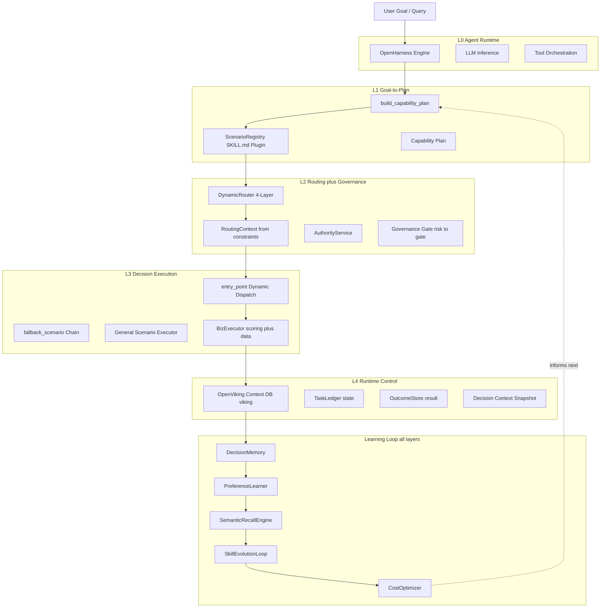

## Architecture

### System Architecture (5-Layer + Learning Loop)



### 五层 + 学习闭环设计

```
L0  Agent Runtime        OpenHarness engine LLM 推理 加 工具调用编排
L1  Goal-to-Plan       ScenarioRegistry 插件化 to 能力规划 to 治理约束生成
L2  Routing and Governance DynamicRouter 四层路由 plus RoutingContext to 能力签发 to 治理门控
L3  Decision Execution     entry_point 动态分发 plus fallback 链 plus General 兜底执行器
L4  Runtime Control       OpenViking 上下文数据库 plus 任务账本 plus Outcome 回写 plus 决策环境快照
and  Learning Loop         决策记忆 plus 偏好学习 plus 语义召回 plus 技能自进化 plus Token Economics 贯穿全层
```

**Layer 0: Agent Loop** - 基于 OpenHarness engine，流式 LLM 推理加多轮工具调用编排。ScenarioRegistry 是场景插件化核心：新场景通过 SKILL.md 声明 entry_point、fallback_scenario、match_rules、risk_level，无需改 engine.py。

**Layer 1: Goal-to-Plan Compiler** - `build_capability_plan()` 把自然语言目标编译为结构化 plan。ScenarioRegistry **替代了 5 个硬编码字典**，成为场景元数据的单源真相。

**Layer 2: Routing and Governance** - `DynamicRouter` 四层路由引擎（规则匹配 to 场景语义 to 成本约束 to 降级兜底），通过 `_build_routing_context()` 从 plan 的 constraints/payload 动态构建 RoutingContext。GovernanceGate 将 risk_level（来自 SKILL.md）映射为 gate_status：`high to denied`，`medium to degraded`，`low to allowed`。

**Layer 3: Decision Execution** - 通过 entry_point 动态加载场景执行函数，未命中则沿 fallback_scenario 链降级，最终兜底到 `_run_general_scenario()`（零假设通用评分推荐）。

**Layer 4: Runtime Control** - OpenViking 上下文数据库提供统一存储与检索（viking:// URI plus L0/L1/L2 渐进加载），TaskLedger 跟踪执行状态，OutcomeStore 回写结果，决策环境快照记录完整决策上下文。

**Learning Loop** - 贯穿全层：DecisionMemory 存储完整决策记录，PreferenceLearner 从用户实际选择中学习个性化权重，SemanticRecallEngine 语义召回相似历史决策，SkillEvolutionLoop **已集成到 orchestrator 成功路径**，实现 collect to learn to validate to deploy 四步闭环，CostOptimizer Token 经济学优化。

### 架构关键更新（UOW-5/6 完成后）

| 更新项 | 之前 | 现在 |
|--------|------|------|
| L1 场景识别 | 5 个硬编码字典 _SCENARIO_META 等 | ScenarioRegistry plus SKILL.md 声明式注册，单源真相 |
| L2 路由上下文 | routing_context equals None 绕过 DynamicRouter | _build_routing_context 从 constraints 动态构建，无约束时返回 None 向后兼容 |
| L3 场景分发 | if scenario equals procurement 硬编码分发 | entry_point 动态加载 plus fallback_scenario 链 plus 通用兜底 |
| L3 hotel_biztravel | _looks_like_hotel_biztravel_query 短路绕过 Registry | dual_signal match 规则，回归 Registry 统一匹配 |
| 治理门控 | 硬编码 risk_level 字典 | 从 SKILL.md risk_level 字段读取单源真相 |
| SkillEvolutionLoop | 隔离在 evolution 目录未接入主流程 | 集成到 orchestrator 成功路径，每次决策自动收集反馈 |

### 决策环境快照（Decision Context Snapshot）

Velaris 的核心差异化之一：不只记录"推荐了什么"，而是记录"在什么环境下、基于什么变量、做出了什么决策"。

每次决策完成后，系统自动快照以下信息：

| 快照类别 | 包含内容 | 用途 |
|----------|----------|------|
| 环境变量 | 原始意图、结构化 intent、Agent 抓取到的所有候选项 | 回放决策当时的信息环境 |
| 决策变量 | 使用的权重、每个选项每个维度的评分明细、调用了哪些工具 | 解释为什么推荐这个 |
| 治理变量 | 路由 trace、能力令牌、任务状态变迁、outcome 指标 | 审计合规 |
| 输出快照 | 系统推荐、备选方案、推荐理由 | 对比分析 |
| 反馈数据 | 用户最终选择、满意度 0 to 5、结果备注 | 偏好学习输入 |

这套快照机制使得：
and 回放：任何历史决策都可以还原当时的完整上下文
and 审计：治理链路（路由 to 授权 to 执行 to 结果）全程可追溯
and 学习：PreferenceLearner 从 user_choice vs recommended 的差异中学习权重调整
and 对比：同一用户在不同时间点对同类问题的决策环境变化可量化

### 数据获取策略

决策过程中需要的各种数据由 Agent 自主获取，不需要预置：

```
Agent 收到目标
 and  build_capability_plan 识别需要什么数据
 and  Agent 自主选择工具 web_search  or  领域 API  or  MCP server
 and  抓取候选项数据
 and  数据进入 DecisionRecord.options_discovered
 and  评分、路由、执行
 and  完整环境快照落盘
```

Velaris 不关心数据从哪来，关心的是：拿到数据之后，怎么评分、怎么路由、怎么治理、怎么记住这次决策环境。

### 安全架构

Velaris 把关键安全能力下沉到 src/openharness/security/，不依赖模型"自觉"：

and 危险命令审批：bash 工具执行前做危险命令识别，支持 manual  or  smart  or  off 三档
and 会话级审批状态：已审批规则只在当前会话复用，不跨会话串联
and 上下文注入扫描：AGENTS.md、dot cursorrules 等在注入系统提示前先做威胁扫描
and MCP 凭据过滤：stdio MCP 子进程默认只继承安全环境变量
and 敏感输出脱敏：Shell 输出与 MCP 错误文本统一做密钥/令牌脱敏
and 文件系统边界：拒绝写入 dot ssh、tilde slash .velaris-agent、slash etc 等敏感位置
and 输入清洗：bash.cwd  or  MCP cwd 经过字符白名单校验

详细设计见 docs/SECURITY-EXECUTION-HARDENING.md。

### 当前代码结构

and src/openharness/：Agent Loop、工具协议、技能、权限、CLI 等通用运行时
and src/velaris_agent/biz/engine.py：场景执行引擎（entry_point 动态分发 plus fallback 链）
and src/velaris_agent/velaris/：路由（DynamicRouter plus RoutingContext）、授权、账本、Outcome 等治理闭环
and src/velaris_agent/memory/：决策记忆、偏好学习、语义召回（SemanticRecallEngine）
and src/velaris_agent/evolution/：技能自进化（SkillEvolutionLoop）、Token 经济学（CostOptimizer）、自进化引擎
and src/velaris_agent/context/：OpenViking 上下文数据库（viking:// URI plus L0/L1/L2 渐进加载）
and src/velaris_agent/scenarios/：ScenarioRegistry 插件化场景（SKILL.md entry_point/fallback_scenario/match_rules/risk_level）
and src/openharness/tools/：把 lifegoal / travel / tokencost / robotclaw 等能力暴露给 Agent

### 数据飞轮

```
用户目标 to  Agent 自主抓取数据 to 决策环境快照 to 偏好学习 plus 语义召回 to 权重更新 to 推荐更准
                                              downarrow
                                    SkillEvolutionLoop to 技能自进化
                                    CostOptimizer to  Token 经济学优化
```

每次决策的完整环境（意图 plus 抓取到的数据 plus 评分 plus 路由 trace plus 用户选择 plus 满意度）都被快照记录。PreferenceLearner 从实际选择中学习个性化权重，SemanticRecallEngine 语义召回相似历史，SkillEvolutionLoop 闭环进化技能，CostOptimizer 优化 Token 开销。用的人越多，推荐越准、成本越低。

### Velaris 2.0 开发进度（UOW 全完成）

| UOW | 名称 | 状态 | 核心交付 |
|-----|------|------|----------|
| UOW-1 | Architecture Boundary | done | ExecutionContract plus PersistenceBarrier plus Envelope-first 输出 |
| UOW-4 | OpenViking Context DB | done | viking:// URI plus L0/L1/L2 渐进加载 plus Local/HTTP 双模式 |
| UOW-5 | ScenarioRegistry | done | SKILL.md 插件化 plus discover/match/reload plus 消除 5 个硬编码字典 |
| UOW-6 | DynamicRouter | done | 四层路由（规则/语义/成本/降级）plus DecisionCostTracker plus RoutingContext |
| UOW-7 | Semantic Recall | done | SemanticRecallEngine plus HybridRecall plus 相似决策召回 |
| UOW-8 | Token Economics | done | SkillEvolutionLoop 集成 orchestrator plus CostOptimizer plus LoadingTier 分级优化 |

### 基座引擎能力全景

| 能力 | 状态 | 实现 |
|------|------|------|
| Goal to Plan 编译 | done | build_capability_plan plus ScenarioRegistry 插件化场景识别 |
| OpenViking 上下文 | done | viking:// URI scheme plus L0_SUMMARY/L1_CONTEXT/L2_FULL 渐进加载 |
| 四层动态路由 | done | DynamicRouter：规则匹配 to 场景语义 to 成本约束 to 降级兜底 |
| RoutingContext 构建 | done | _build_routing_context 从约束动态构建，无约束时 None |
| entry_point 动态分发 | done | SKILL.md entry_point 字段，动态加载场景执行函数 |
| fallback_scenario 链 | done | SKILL.md fallback_scenario 字段，未命中时沿链降级 |
| 能力签发 | done | AuthorityService 短时令牌 |
| 任务跟踪 | done | TaskLedger 状态机 |
| Outcome 回写 | done | OutcomeStore 结果记录 |
| 决策记忆 | done | SQLite（SqliteDecisionMemory）plus OpenViking 上下文数据库双存储 |
| 语义召回 | done | SemanticRecallEngine 向量 plus 关键词混合召回 |
| 偏好学习 | done | PreferenceLearner 贝叶斯先验 plus 指数衰减 |
| 技能自进化 | done | SkillEvolutionLoop 集成到 orchestrator，collect to learn to validate to deploy 四步闭环 |
| Token 经济学 | done | CostOptimizer 加载分级 plus 模型推荐 plus 预算门控 |
| 安全纵深防御 | done | 命令审批 plus 凭据过滤 plus 输出脱敏 plus 文件边界 |
| Skills Hub | done | 多源发现 plus 安全扫描 plus 锁文件 plus  CLI |

### 作为基座引擎的下一步方向

| 方向 | 当前状态 | 目标状态 | 优先级 |
|------|----------|----------|--------|
| 多租户隔离 | 单用户 session 级 | tenant 级隔离（决策记忆、偏好、路由策略独立） | P0 |
| Outcome 聚合分析 | 单条记录查询 | 跨场景、跨时间段的 outcome 聚合统计和趋势分析 | P1 |
| 快照对比与回放 API | 快照数据已落盘，但缺少结构化查询和对比接口 | 提供 diff API：同用户不同时间点的决策环境变化可量化 | P1 |
| 运行时指标驱动路由 | DynamicRouter 已支持四层路由，成本维度已接入 | 接入负载/SLA/可用性等更多运行时指标 | P2 |
