# Execution Plan

## Detailed Analysis Summary

### Transformation Scope (Brownfield Only)
- **Transformation Type**: Architectural
- **Primary Changes**: 收束 `Velaris` 与 `OpenHarness` 的正式边界；为默认路径补齐更清晰的执行语义、状态语义、完成语义和恢复语义
- **Related Components**:
  - `src/velaris_agent/velaris/*`
  - `src/velaris_agent/persistence/*`
  - `src/velaris_agent/memory/types.py`
  - `src/openharness/tools/biz_execute_tool.py`
  - `src/openharness/services/session_storage.py`
  - `README.md`
  - `aidlc-docs/`
  - `docs/superpowers/plans/*`

### Change Impact Assessment
- **User-facing changes**: No - 本轮主要为架构定位、默认语义和文档/测试收束，用户入口保持兼容
- **Structural changes**: Yes - 明确 `Velaris` 为整体架构主体，`OpenHarness` 为执行基座，并引入轻量执行契约层
- **Data model changes**: Yes - 需要增加或收束执行对象、状态链角色和恢复边界的模型/契约
- **API changes**: Yes - 主要是内部 API / tool payload / orchestrator 输出结构可能小幅调整，以承载更清晰的 execution 语义
- **NFR impact**: Yes - 重点改善可解释性、可验证性、审计性和默认路径一致性

### Component Relationships (Brownfield Only)

#### Primary Component
- `velaris_agent.velaris`
  - 当前承载路由、授权、任务账本、outcome 和编排器
  - 是本轮默认语义收束的主轴

#### Infrastructure Components
- `velaris_agent.persistence`
  - 决定默认 durable 路径与增强路径的边界
- `openharness.services.session_storage`
  - 决定会话恢复边界

#### Shared Components
- `velaris_agent.memory.types`
- `velaris_agent.biz.engine`
- `config/routing-policy.yaml`
- `README.md`

#### Dependent Components
- `openharness.tools.biz_execute_tool`
- 相关 focused tests
- AI-DLC / superpowers 文档

#### Supporting Components
- `aidlc-docs/inception/reverse-engineering/*`
- `docs/superpowers/plans/2026-04-16-velaris-phase1-persistence-foundation.md`
- `docs/superpowers/specs/2026-04-16-velaris-decision-engine-design.md`

### Risk Assessment
- **Risk Level**: High
- **Rollback Complexity**: Moderate
- **Testing Complexity**: Complex

原因：
- 这是跨模块的架构收束，不是单点修补
- 任何定位收束都可能影响 orchestrator/tool/doc/test 多处输出
- 但本轮不引入新中间件、不做大规模拆库，仍可控

## Workflow Visualization

### Mermaid Diagram

```mermaid
flowchart TD
    Start([User Request])

    subgraph INCEPTION["INCEPTION PHASE"]
        WD["Workspace Detection<br/><b>COMPLETED</b>"]
        RE["Reverse Engineering<br/><b>COMPLETED</b>"]
        RA["Requirements Analysis<br/><b>COMPLETED</b>"]
        US["User Stories<br/><b>SKIP</b>"]
        WP["Workflow Planning<br/><b>COMPLETED</b>"]
    end

    subgraph CONSTRUCTION["CONSTRUCTION PHASE"]
        AD["Application Design<br/><b>EXECUTE</b>"]
        UG["Units Generation<br/><b>EXECUTE</b>"]
        FD["Functional Design<br/><b>EXECUTE</b>"]
        NFRR["NFR Requirements<br/><b>EXECUTE</b>"]
        NFRD["NFR Design<br/><b>EXECUTE</b>"]
        ID["Infrastructure Design<br/><b>SKIP</b>"]
        CG["Code Generation<br/><b>EXECUTE</b>"]
        BT["Build and Test<br/><b>EXECUTE</b>"]
    end

    End([User Approval To Enter Construction])

    Start --> WD --> RE --> RA --> US --> WP --> AD --> UG --> FD --> NFRR --> NFRD --> ID --> CG --> BT --> End

    style WD fill:#4CAF50,stroke:#1B5E20,stroke-width:3px,color:#fff
    style RE fill:#4CAF50,stroke:#1B5E20,stroke-width:3px,color:#fff
    style RA fill:#4CAF50,stroke:#1B5E20,stroke-width:3px,color:#fff
    style WP fill:#4CAF50,stroke:#1B5E20,stroke-width:3px,color:#fff
    style US fill:#BDBDBD,stroke:#424242,stroke-width:2px,stroke-dasharray: 5 5,color:#000
    style AD fill:#FFA726,stroke:#E65100,stroke-width:3px,stroke-dasharray: 5 5,color:#000
    style UG fill:#FFA726,stroke:#E65100,stroke-width:3px,stroke-dasharray: 5 5,color:#000
    style FD fill:#FFA726,stroke:#E65100,stroke-width:3px,stroke-dasharray: 5 5,color:#000
    style NFRR fill:#FFA726,stroke:#E65100,stroke-width:3px,stroke-dasharray: 5 5,color:#000
    style NFRD fill:#FFA726,stroke:#E65100,stroke-width:3px,stroke-dasharray: 5 5,color:#000
    style ID fill:#BDBDBD,stroke:#424242,stroke-width:2px,stroke-dasharray: 5 5,color:#000
    style CG fill:#FFA726,stroke:#E65100,stroke-width:3px,stroke-dasharray: 5 5,color:#000
    style BT fill:#FFA726,stroke:#E65100,stroke-width:3px,stroke-dasharray: 5 5,color:#000
    style Start fill:#CE93D8,stroke:#6A1B9A,stroke-width:3px,color:#000
    style End fill:#CE93D8,stroke:#6A1B9A,stroke-width:3px,color:#000

    linkStyle default stroke:#333,stroke-width:2px
```



### Text Alternative

```text
Phase 1: INCEPTION
- Stage 1: Workspace Detection (COMPLETED)
- Stage 2: Reverse Engineering (COMPLETED)
- Stage 3: Requirements Analysis (COMPLETED)
- Stage 4: User Stories (SKIP)
- Stage 5: Workflow Planning (COMPLETED)

Phase 2: CONSTRUCTION
- Stage 1: Application Design (EXECUTE)
- Stage 2: Units Generation (EXECUTE)
- Stage 3: Functional Design (EXECUTE)
- Stage 4: NFR Requirements (EXECUTE)
- Stage 5: NFR Design (EXECUTE)
- Stage 6: Infrastructure Design (SKIP)
- Stage 7: Code Generation (EXECUTE)
- Stage 8: Build and Test (EXECUTE)
```

## Phase Determination

### User Stories
- **Decision**: SKIP
- **Reason**:
  - 本轮不是新用户功能，也不是用户旅程重构
  - 本轮主要解决运行时定位、状态链、恢复边界和默认语义
  - User Stories 对本轮收益较低

### Application Design
- **Decision**: EXECUTE
- **Reason**:
  - 需要重新定义 `Velaris` 与 `OpenHarness` 的正式边界
  - 需要明确 execution contract、state contract、resume contract

### Units Generation
- **Decision**: EXECUTE
- **Reason**:
  - 需要把后续改动拆成清晰单元
  - 需要锁定先改模型/契约，还是先改 orchestrator/persistence/tool wiring

### Functional Design
- **Decision**: EXECUTE
- **Reason**:
  - 需要定义新的执行对象或执行契约接口
  - 需要明确 orchestrator、task/outcome、tool payload 的收束方式

### NFR Requirements
- **Decision**: EXECUTE
- **Reason**:
  - 本轮核心正是默认路径的一致性、可验证性、审计性和向后兼容

### NFR Design
- **Decision**: EXECUTE
- **Reason**:
  - 需要把上述 NFR 落到具体设计策略

### Infrastructure Design
- **Decision**: SKIP
- **Reason**:
  - 本轮不是部署形态升级
  - PostgreSQL 仍保持增强路径，不引入新中间件或新部署结构

## Module Update Strategy

- **Update Approach**: Sequential
- **Critical Path**:
  1. 锁定架构定位与 contracts
  2. 收束 `velaris_agent.velaris` 层模型与 orchestrator
  3. 调整 persistence / session storage / tool wiring
  4. 补 focused tests
  5. 同步 README 与 AI-DLC 文档
- **Coordination Points**:
  - `VelarisBizOrchestrator` 输出结构
  - `TaskLedger / OutcomeStore / AuditStore` 的默认职责
  - `session_storage` 与业务执行恢复边界
  - `biz_execute` 工具输出
- **Testing Checkpoints**:
  - orchestrator focused tests
  - biz execute focused tests
  - requirements-to-doc consistency check

## Recommended Construction Sequence

### Construction Unit 1 - Architecture Boundary Contract
- 明确 `Velaris` vs `OpenHarness` 的正式边界
- 明确 execution/state/resume/complete 四类 contract

### Construction Unit 2 - Runtime Model And Orchestrator Convergence
- 为执行单元建立轻量一等对象或统一 payload contract
- 收束 orchestrator 输出与默认状态链

### Construction Unit 3 - Persistence And Resume Boundary Cleanup
- 明确默认 durable 链与增强路径边界
- 明确 session resume 不等于 execution resume

### Construction Unit 4 - Tool Surface And Verification
- 收束 `biz_execute` 等关键工具输出
- 增加 focused tests，证明默认路径闭环更清晰

### Construction Unit 5 - Documentation Alignment
- 修正 README、AI-DLC 文档和现有计划中的定位表述

## Recommended Next Artifact Set

进入 Construction 后，优先生成：

1. Application Design
2. Units Generation
3. Functional Design
4. NFR Requirements
5. NFR Design

再进入 Code Generation 与 Build/Test。
