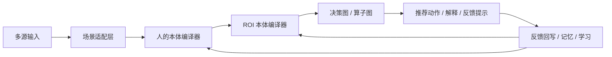

# Velaris 多场景 ROI 决策本体技术方案

> 目标：把 `velaris-agent` 从“可用的决策执行内核”继续推进为“**本体驱动的多场景 ROI 决策内核**”。
>  
> 这里的“本体”不是先做 RDF/OWL，而是先做**稳定、可解释、可学习、可持久化**的领域模型。

## 1. 方案定位

`velaris-agent` 不承载具体业务内容，也不写死某一个行业语义。它要做的是：

- 接收结构化输入；
- 将输入映射为统一本体；
- 计算收益、成本、风险、时效、置信度；
- 选择 ROI 最优的动作或动作组合；
- 把结果、解释和反馈沉淀到记忆与学习层。

因此，`velaris-agent` 的核心不是“写作 agent”或“旅价 agent”，而是：

**多场景 ROI 决策本体内核**。

`saibo_yanling` 则负责具体业务适配，例如写作复盘、训练卡、阅读计划、家长端展示和服务端落库。

## 2. 本体分层

我们建议把本体分成三层：

| 层级 | 名称 | 作用 |
|---|---|---|
| L0 | 通用决策原语 | 所有场景共享的稳定对象 |
| L1 | 人的本体 | 描述“谁在决策、处于什么状态、受什么约束” |
| L2 | ROI 本体 | 描述“这次决策值不值得做” |
| L3 | 场景本体 | 描述“在某个场景下，哪些特征是有意义的” |

### 2.1 通用决策原语

这些原语是跨场景稳定的，不应该带行业词：

- `DecisionObjective`
- `EvidenceSignal`
- `CandidateAction`
- `ActionBundle`
- `DecisionResult`
- `FeedbackRecord`

### 2.2 人的本体

人的本体回答的是：**这个用户现在是什么状态、有什么习惯、拥有什么能力、受到什么约束**。

它不是完整人格画像，更不是无边界个人档案。  
对于儿童产品，更应该聚焦“决策相关的人本体”，避免无意义的标签化推断。

### 2.3 ROI 本体

ROI 本体回答的是：**在这个人的状态下，当前这组动作是否值得做**。

它不是单一分数，而是一个可解释的向量对象，再由策略层汇总成最终排序。

## 3. 总体架构



## 4. 人的本体怎么建

### 4.1 建模原则

- **只建决策相关的人本体**：不做无边界人格分析。
- **习惯优先于标签**：习惯用事件序列和聚合特征表达，而不是简单贴标签。
- **行为优先于主观判断**：尽量记录可观测行为，不把“拖延”“不自律”直接写成事实。
- **职业降级为角色上下文**：对成年人，职业是影响时间和支持方式的重要上下文；对儿童产品，职业通常不应成为核心变量，更多保留家长/陪伴/支持角色。
- **所有派生结论都要带置信度**：任何画像结论都应该有 `confidence` 和 `updated_at`。
- **最小化敏感信息**：只保留决策需要的最小字段集。

### 4.2 建模范围

人的本体建议覆盖以下六层：

| 层 | 说明 | 示例字段 |
|---|---|---|
| 稳定层 | 相对稳定的身份与角色 | `age_band`, `grade`, `role_context`, `language`, `region` |
| 习惯层 | 重复发生的行为节奏 | `reading_window`, `writing_window`, `review_frequency`, `response_latency` |
| 行为层 | 可观测的执行方式 | `completion_rate`, `dropoff_pattern`, `feedback_acceptance`, `follow_through` |
| 能力层 | 在场景中的能力状态 | `structure_skill`, `language_skill`, `attention_span`, `independent_completion` |
| 约束层 | 外部与内部约束 | `time_budget`, `device_limit`, `caregiver_availability`, `emotion_state` |
| 偏好层 | 稳定偏好与可学习偏好 | `preference_weights`, `topic_bias`, `format_preference` |

### 4.3 推荐对象

建议把人本体拆成这些对象：

- `UserProfileOntology`
- `HabitPattern`
- `BehaviorState`
- `RoleContext`
- `CapabilityState`
- `ConstraintState`
- `PreferenceState`

### 4.4 建模方式

#### 4.4.1 事件驱动

把用户行为先记录成事件，再从事件中提炼状态：

- 读了什么
- 写了什么
- 是否按时完成
- 是否需要提醒
- 哪类反馈最容易接受

#### 4.4.2 聚合特征

对事件序列做时间衰减和窗口聚合：

- 最近 7 天 / 30 天的完成率
- 连续执行天数
- 典型响应时间
- 复盘后的改进幅度

#### 4.4.3 状态快照

对外输出时，不直接暴露原始事件，而是输出当前快照：

- 当前习惯画像
- 当前能力画像
- 当前约束画像
- 当前偏好权重

### 4.5 人本体的开发顺序

1. 先定义最小可用字段；
2. 先接入可观测事件；
3. 再做聚合特征；
4. 再做能力/习惯推断；
5. 最后再做跨场景迁移。

## 5. ROI 本体怎么建

### 5.1 ROI 的定义

ROI 不是单纯“收益 / 成本”一个数，而是：

> 在给定约束下，某个动作或动作组合，能为当前主体带来多大净收益。

因此建议把 ROI 本体拆成几个部分：

| 维度 | 说明 | 常见字段 |
|---|---|---|
| 收益 | 做这件事能带来什么 | `short_term_gain`, `long_term_gain`, `learning_gain`, `transfer_gain` |
| 成本 | 做这件事要花什么 | `time_cost`, `money_cost`, `cognitive_cost`, `execution_cost` |
| 风险 | 失败或副作用是什么 | `failure_risk`, `dependency_risk`, `misguidance_risk`, `opportunity_cost` |
| 时效 | 什么时候见效 | `time_to_value`, `horizon`, `decay_rate` |
| 置信 | 这个判断有多确定 | `confidence`, `evidence_strength`, `observability` |
| 学习价值 | 对长期成长有没有帮助 | `learning_value`, `habit_value`, `independence_gain` |

### 5.2 推荐对象

建议把 ROI 本体拆成这些对象：

- `DecisionROIProfile`
- `BenefitModel`
- `CostModel`
- `RiskModel`
- `HorizonModel`
- `ConfidenceModel`
- `LearningImpactModel`

### 5.3 不要只保留一个总分

单一总分会让不同场景无法兼容。  
建议同时保留：

- `expected_roi`
- `risk_adjusted_roi`
- `learning_value`
- `dependency_penalty`
- `time_to_value`
- `confidence`

这样旅价、写作、采购、学习规划都能复用同一个内核，但各自权重不同。

### 5.4 ROI 计算建议

ROI 计算分两层：

1. **场景层**：由场景适配器决定收益/成本/风险的字段和权重；
2. **内核层**：统一做归一化、排序、解释和学习。

一个推荐动作的最终输出最好包含：

- 归一化得分
- 各维度拆解
- 风险修正说明
- 推荐原因
- 备选原因

### 5.5 ROI 开发顺序

1. 先定义通用收益/成本/风险字段；
2. 再定义场景权重模板；
3. 再定义时间衰减和置信度；
4. 再定义学习回写；
5. 最后做跨场景对比和回放。

## 6. 场景本体怎么接入

场景本体不应该污染核心内核，它只负责把本场景的输入映射成通用对象。

### 6.1 场景适配层的职责

每个场景适配器只做四件事：

1. 解释场景输入；
2. 把输入映射为人本体和 ROI 本体；
3. 提供场景权重与约束；
4. 写回场景反馈字段。

### 6.2 场景示例

#### 写作场景

- 人本体重点：习惯、执行力、语言能力、独立完成能力
- ROI 重点：结构提升、语言提升、依赖风险下降、长期积累收益
- 适配输出：日训练卡、周复盘卡、阅读推荐、长期积累方向

#### 旅价场景

- 人本体重点：预算偏好、时效偏好、行程节奏、家庭/组织约束
- ROI 重点：节省金额、时间成本、舒适度、可执行性
- 适配输出：推荐方案、备选方案、解释、预算边界

#### 采购场景

- 人本体重点：组织角色、审批链路、成本敏感度、合规敏感度
- ROI 重点：预算、履约风险、质量、协商空间
- 适配输出：候选排序、协商建议、风险提示

#### 学习规划场景

- 人本体重点：学习节奏、注意力窗口、复盘接受度、持续性
- ROI 重点：长期收益、习惯收益、时间成本、依赖风险
- 适配输出：周计划、月计划、复盘重点

## 7. 当前代码里可以直接复用什么

`velaris-agent` 其实已经有一部分非常接近本体化的代码基础，应该顺着它演进，而不是推倒重来。

### 7.1 已有基础

- `src/velaris_agent/memory/types.py`
  - 已经有 `DecisionGoal`、`OrgPolicy`、`DecisionRecord`、`AlignmentReport`、`UserPreferences`
  - 这是人本体和 ROI 本体的最直接基础

- `src/velaris_agent/decision/context.py`
  - 已经有决策执行上下文和图执行结果
  - 适合作为本体编译后的运行态容器

- `src/velaris_agent/decision/operators/*`
  - 已经把意图、发现、归一化、可行性、Pareto、协商、偏差审计、解释拆成算子
  - 这是本体驱动算子图的基础

- `src/velaris_agent/decision/graph.py`
  - 已经能按场景装配算子链
  - 未来可以把“本体编译器”放在 graph 前面

- `src/velaris_agent/scenarios/registry.py`
  - 已经支持 SKILL.md 驱动的场景注册
  - 场景本体可以直接挂在这里

- `src/velaris_agent/velaris/router.py`
  - 已经能做路由治理、预算、SLA、合规判断
  - 适合作为 ROI 决策的治理层

- `src/velaris_agent/velaris/cost_tracker.py`
  - 已经能追踪 token 成本和 ROI 报告
  - 未来可以把“教育 ROI / 业务 ROI”也统一进来

- `src/velaris_agent/biz/engine.py`
  - 现在仍是场景识别和执行的入口
  - 未来应该收敛为场景适配层，而不是把业务逻辑都塞在这里

### 7.2 需要收敛的部分

当前最需要抽象的是：

- `src/velaris_agent/decision/contracts.py`
  - 现在偏酒店 / 商旅语义
  - 应升级为中性决策契约，避免业务词污染核心边界

- `src/velaris_agent/biz/engine.py`
  - 现在承担了较多场景知识
  - 应下沉为场景适配和执行桥接，不再承载核心本体

- `src/velaris_agent/velaris/orchestrator.py`
  - 继续保留，但只做编排，不做业务语义决策

## 8. 推荐的代码组织

建议逐步形成以下结构：

```text
src/velaris_agent/
├── ontology/
│   ├── base.py
│   ├── types.py
│   ├── registry.py
│   └── scenes/
├── decision/
│   ├── contracts.py
│   ├── context.py
│   ├── graph.py
│   └── operators/
├── scenarios/
│   ├── registry.py
│   ├── skill_loader.py
│   ├── travel/
│   ├── hotel_biztravel/
│   ├── procurement/
│   ├── robotclaw/
│   └── lifegoal/
├── memory/
│   ├── types.py
│   ├── decision_memory.py
│   ├── preference_learner.py
│   └── semantic_recall.py
└── velaris/
    ├── router.py
    ├── orchestrator.py
    ├── cost_tracker.py
    └── outcome_store.py
```

## 9. 数据与持久化

### 9.1 基本原则

- 任何关键的人本体字段、ROI 字段、反馈字段，都不应该只停留在 prompt 或内存里。
- 核心字段要可落库、可查询、可回放。
- 扩展字段可以 JSON 化，但关键分析字段最好显式列化。

### 9.2 建议的持久化对象

- `human_ontology_snapshots`
- `roi_profiles`
- `decision_feedback_records`
- `scene_ontology_snapshots`

### 9.3 持久化策略

短期可以继续使用当前仓库已有的 SQLite / 文件持久化模式。  
如果后续进入多租户和更强分析场景，再迁移到 PostgreSQL 也不会破坏本体设计，因为本体对象是稳定的。

## 10. 发展路径

### Phase 1：冻结核心本体

- 明确通用决策原语；
- 收敛中性契约；
- 规定人本体和 ROI 本体的最小字段集。

### Phase 2：做人本体

- 接入事件序列；
- 形成习惯、行为、能力、约束快照；
- 支持场景级复用。

### Phase 3：做 ROI 本体

- 定义收益 / 成本 / 风险 / 时效 / 置信度；
- 支持向量化输出和解释；
- 接入 `cost_tracker` / `preference_learner`。

### Phase 4：做场景适配器

- 写作场景先接入；
- 旅价 / 采购 / 学习规划复用同一套本体；
- 场景只提供自己的语义映射和权重。

### Phase 5：做反馈学习闭环

- 把推荐、用户选择、满意度、后续效果全部回写；
- 让人本体和 ROI 本体共同进化；
- 让下一次推荐更准。

## 11. 验收标准

- `velaris-agent` 不再依赖单一场景语义；
- 人本体有稳定、可解释、可学习的字段；
- ROI 本体有收益、成本、风险、时效、置信度维度；
- 新场景接入时不需要改核心语义；
- 每次决策都能输出解释和反馈建议；
- 关键本体字段可持久化，不只存在于内存或 prompt；
- 写作、旅价、采购、学习规划都能复用同一套内核。

## 12. 结论

`velaris-agent` 的下一阶段，不是再加一个业务壳，而是把“决策内核”升级成“本体驱动的 ROI 决策系统”。

最重要的两件事是：

1. **人的本体要做**，但要做成“决策相关的人本体”；
2. **ROI 本体也要做**，而且要和人本体一起成为决策的双核心。

这样，写作、旅价、采购、学习规划等不同场景，才能共享同一个底座，而不会互相污染。

## 13. 细化文档索引

后续细化已经拆成两份更落地的方案：

- `docs/ontology-package-plan.md`：`src/velaris_agent/ontology/` 的目录结构、对象模型、生命周期和持久化边界
- `saibo_yanling/docs/writing-adapter-plan.md`：写作场景在 `saibo_yanling` 的字段表、当前快照和历史计划的落库方式（已移出 `velaris-agent`）

## 14. 对外输入 / 输出契约

`velaris-agent` 的契约层建议收敛成“少而稳”的公共边界，而不是把内部算子、路由和执行细节直接暴露给上游。

### 14.1 公共输入契约

建议对外暴露 3 类核心输入：

| 契约 | 作用 | 是否必需 |
|---|---|---|
| `DecisionRequest` | 统一的 ROI 决策输入，承载目标、证据、候选动作、约束和人本体快照 | 必需 |
| `FeedbackEvent` | 决策后的真实反馈回写，用于学习和画像更新 | 必需 |
| `OntologySnapshot` | 人本体 / 场景本体 / ROI 本体的快照输入或读取结果 | 按场景可选 |

#### `DecisionRequest` 建议字段

- `request_id`：请求唯一 ID
- `timestamp`：请求时间
- `scenario`：场景标识，例如 `writing` / `travel` / `procurement`
- `decision_type`：`action_rank` / `bundle_rank` / `plan_next_step` / `feedback_review`
- `objective`：目标定义，包含目标描述、优先级、成功指标
- `subject`：决策主体，包含 `subject_type`、`subject_id`、`role_context`
- `human_state`：人的本体快照，例如习惯、行为、能力、约束、偏好
- `roi_context`：ROI 本体上下文，例如收益、成本、风险、时效、置信度、学习价值
- `evidence_signals`：输入证据列表
- `candidate_actions`：候选动作列表
- `action_bundles`：动作组合列表，只有 bundle 场景才需要
- `constraints`：硬约束
- `governance`：审计、审批、合规要求
- `context`：tenant / session / source / locale 等运行上下文
- `output_hints`：是否需要解释、trace、follow-up questions

#### `FeedbackEvent` 建议字段

- `feedback_id`
- `request_id` / `decision_id`
- `scenario`
- `selected_action_id` 或 `selected_bundle_id`
- `outcome`：真实结果摘要
- `user_feedback`：用户/家长/业务方满意度
- `actual_cost`、`actual_benefit`、`actual_risk`：可选的后验评估
- `effect_window`：见效时间窗
- `notes`：补充备注
- `evidence_refs`：证据引用

#### `OntologySnapshot` 建议字段

- `snapshot_id`
- `subject_type`：`user` / `org` / `scene`
- `subject_id`
- `scenario`
- `version`
- `state`：快照主体
- `confidence`
- `updated_at`

### 14.2 公共输出契约

建议对外暴露 2 类核心输出：

| 契约 | 作用 | 是否必需 |
|---|---|---|
| `DecisionResponse` | 统一的 ROI 决策结果 | 必需 |
| `ExecutionEnvelope` | 运行时执行包络，保留给编排 / 工具执行链路 | 可选 |

#### `DecisionResponse` 建议字段

- `request_id`
- `decision_id`
- `scenario`
- `decision_type`
- `status`：`ok` / `need_more_input` / `blocked` / `degraded` / `error`
- `selected_action_id` / `selected_bundle_id`
- `ranked_actions` / `ranked_bundles`
- `candidate_briefs`
- `roi_breakdown`：收益、成本、风险、时效、置信度、学习价值
- `reason_codes`
- `why_selected`
- `why_not_others`
- `tradeoffs`
- `uncertainty_flags`
- `follow_up_questions`
- `next_actions`
- `writeback_hints`
- `trace`

#### `ExecutionEnvelope` 的定位

`ExecutionEnvelope` 不建议作为“业务主契约”对外扩散，它更适合保留给 `velaris-agent` 自己的运行时和编排层使用。  
如果 `velaris-agent` 还承担工具执行、路由、审批和审计，那么 envelope 可以继续存在；但如果上游只需要“决策结果”，就应该优先消费 `DecisionResponse`。

### 14.3 契约分层原则

- 公共层只暴露中性对象，不暴露酒店、商旅、写作等场景词。
- 场景差异通过 `scenario`、`objective`、`roi_context` 和 `candidate_actions` 注入。
- 内部算子、路由规则、执行补偿、审计细节，不进入公共输入输出。
- `saibo_yanling` 负责把业务语言翻译成这些中性契约。
- `velaris-agent` 负责把契约映射成 ROI 决策与可解释输出。

### 14.4 与现有代码的对应关系

- `src/velaris_agent/velaris/execution_contract.py`
  - 现在的 `DecisionExecutionRequest` / `DecisionExecutionEnvelope` 更偏运行时包络；
  - 后续可在此之上包一层 `DecisionRequest` / `DecisionResponse` 的中性契约。
- `src/velaris_agent/decision/contracts.py`
  - 现在的 `BundleDecisionRequest` / `BundleDecisionResponse` 适合继续承接 `action_rank` / `bundle_rank`；
  - 但字段语义需要从“酒店 / 商旅”进一步中性化。
- `src/velaris_agent/memory/types.py`
  - `DecisionRecord`、`UserPreferences`、`StakeholderContext` 适合成为反馈回写和画像沉淀的底层载体。

## 15. scene_output_schema_v2

`scene_output_schema_v2` 是 `velaris-agent` 面向多场景输出的统一结果 schema。  
它的目标不是让核心内核“懂作文”“懂旅价”，而是把不同场景都收口到同一套输出骨架，再由场景适配器解释为具体业务语言。
更完整的 JSON Schema 与 Pydantic 草图已整理到 `docs/scene-output-schema-v2.md`。

### 15.1 设计原则

- **顶层字段中性化**：不把 `reading`、`writing`、`travel` 这类场景词写死在顶层字段名里。
- **语义下沉到 item.kind**：具体场景差异放在条目类型和 `payload` 中。
- **结果可解释**：每个条目都要带 `reason`、`evidence_refs`。
- **结果可回写**：输出必须能直接映射到反馈和落库字段。
- **输出最小化**：默认只返回最重要的 1-3 条，避免噪音。
- **兼容旧字段**：旧 schema 可保留 alias，但新 schema 统一走 v2。

### 15.2 顶层结构

```ts
SceneOutputV2 {
  schema_id: "scene_output_schema_v2"
  request_id: string
  decision_id: string
  scenario: string
  decision_type: string
  status: "ok" | "need_more_input" | "blocked" | "degraded" | "error"

  summary?: string
  diagnostic_findings: DiagnosticFinding[]
  guidance: GuidanceItem[]
  suggestions: SuggestionItem[]
  next_actions: NextAction[]

  roi_breakdown?: RoiBreakdown
  reason_codes: string[]
  why_selected: string[]
  why_not_others: WhyNotOther[]
  follow_up_questions: string[]
  writeback_hints: WritebackHints
  trace: DecisionTrace
}
```

### 15.3 条目结构

#### 15.3.1 `DiagnosticFinding`

```ts
DiagnosticFinding {
  finding_id: string
  kind: "problem" | "risk" | "constraint" | "strength"
  label: string
  severity?: number   // 0~1
  confidence?: number // 0~1
  reason: string
  evidence_refs: string[]
  payload?: Record<string, any>
}
```

用途：
- 统一承载问题、风险、约束、优势
- 写作场景里可以映射为“问题标签”
- 旅价/采购场景里可以映射为“风险/约束/优势”

#### 15.3.2 `GuidanceItem`

```ts
GuidanceItem {
  guidance_id: string
  kind: "train" | "choose" | "plan" | "review" | "adjust"
  label: string
  priority: number
  why_now: string
  steps: string[]
  success_criteria?: string[]
  estimated_minutes?: number
  payload?: Record<string, any>
}
```

用途：
- 统一承载训练方向、行动指导、选择建议
- 写作场景里可以映射为“训练方向”
- 采购场景里可以映射为“谈判/取舍建议”

#### 15.3.3 `SuggestionItem`

```ts
SuggestionItem {
  suggestion_id: string
  kind: "reading" | "practice" | "option" | "resource" | "reminder" | "adjustment"
  label: string
  reason: string
  evidence_refs: string[]
  payload?: Record<string, any>
}
```

用途：
- 统一承载补充建议、资源建议、候选方案建议
- 写作场景里可表示书籍、篇目、范文
- 旅价场景里可表示备选方案、时间/预算调整建议
- 采购场景里可表示供应商、替代方案、风险缓解建议

#### 15.3.4 `NextAction`

```ts
NextAction {
  action_id: string
  kind: "practice" | "read" | "compare" | "confirm" | "revise" | "follow_up"
  label: string
  sequence: number
  minutes?: number
  done_check: string
  source_id?: string
  payload?: Record<string, any>
}
```

用途：
- 统一承载下一步可执行动作
- 写作场景里可以是“写提纲”“改开头”“读范文”
- 其他场景里可以是“确认方案”“补充约束”“继续比选”

#### 15.3.5 `WhyNotOther`

```ts
WhyNotOther {
  item_id: string
  reason: string
}
```

用途：
- 解释为什么没有选其他动作或建议

#### 15.3.6 `RoiBreakdown`

```ts
RoiBreakdown {
  benefit: number
  cost: number
  risk: number
  learning_value: number
  dependency_penalty: number
  horizon_days?: number
  confidence: number
}
```

用途：
- 让任何场景都能表达 ROI 解释
- 写作场景强调学习价值、依赖惩罚
- 旅价/采购场景强调成本、风险与时效

#### 15.3.7 `WritebackHints`

```ts
WritebackHints {
  profile_state_updates: string[]
  snapshot_updates?: string[]
  plan_table?: boolean
  feedback_table?: boolean
}
```

用途：
- 明确哪些字段要回写
- 方便 `saibo_yanling` 和 `velaris-agent` 做落库分工

#### 15.3.8 `DecisionTrace`

```ts
DecisionTrace {
  evaluated_rules: string[]
  selected_rule: string
  timestamp: string
  model_version?: string
  schema_version?: string
}
```

用途：
- 记录本次输出是如何被决策出来的
- 方便审计和回放

### 15.4 写作场景映射

写作场景不再使用顶层的 `problem_tags`、`reading_suggestions`、`training_directions` 这些业务词，而是映射到通用槽位：

- `diagnostic_findings`
  - 对应作文问题、优势、约束
- `guidance`
  - 对应训练方向、改写策略、复盘重点
- `suggestions`
  - 对应阅读建议、范文建议、篇目建议
- `next_actions`
  - 对应今天/这周可执行动作

写作场景里，`SuggestionItem.kind` 常见取值：

- `reading`
- `practice`
- `resource`

`DiagnosticFinding.kind` 常见取值：

- `problem`
- `strength`
- `constraint`

`GuidanceItem.kind` 常见取值：

- `train`
- `review`
- `adjust`

### 15.5 其他场景映射

#### 旅价场景

- `diagnostic_findings`：预算约束、时效约束、风险点
- `guidance`：推荐取舍策略、优先级
- `suggestions`：候选方案、备选方案、补充约束建议
- `next_actions`：确认、补充信息、继续比选

#### 采购场景

- `diagnostic_findings`：合规风险、履约风险、预算约束
- `guidance`：谈判策略、选择策略、风险缓解策略
- `suggestions`：供应商建议、替代方案、采购组合建议
- `next_actions`：继续比选、补充条款、发起审批

#### 学习规划场景

- `diagnostic_findings`：习惯缺口、能力短板、时间约束
- `guidance`：训练重点、练习路径、复盘节奏
- `suggestions`：题目、材料、书单、范文
- `next_actions`：练习、阅读、复盘、打卡

### 15.6 兼容策略

- `scene_output_schema_v2` 为新主线输出。
- 旧 schema 字段可作为 alias 保留一段时间，但不要再扩散新业务语义。
- 场景差异只放在：
  - `scenario`
  - `decision_type`
  - `item.kind`
  - `item.payload`
- 未来新增场景时，只补：
  - 场景适配器
  - item.kind 映射
  - 本体标签/资源字典

### 15.7 建议的最小输出规则

- `diagnostic_findings`: 1-3 条
- `guidance`: 1-3 条
- `suggestions`: 1-3 条
- `next_actions`: 1-3 条

如果证据不足：

- `status = "need_more_input"`
- 返回 `follow_up_questions`
- 不强行生成建议
