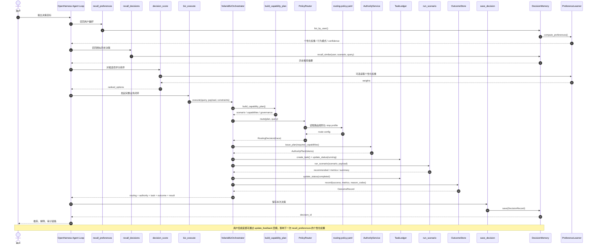

# Velaris-Agent 架构文档（OpenHarness 二开）

## 1. 架构目标

Velaris-Agent 当前不是泛化的“多 Agent 框架展示仓库”，而是一个围绕决策智能构建的运行时：

1. 决策中枢：把自然语言目标编译为结构化 plan，并选择合适的执行路径。
2. 治理中枢：把路由、权限、审批、停止条件从 prompt 习惯中剥离到显式配置和服务。
3. 学习中枢：把历史决策、用户选择和满意度沉淀为长期上下文，驱动下一次推荐更准。
4. 评估中枢：把执行结果沉淀为任务账本和 outcome 记录，支持审计与回放。

## 2. 当前仓库中的逻辑分层

### 2.1 分层视图

| 层级 | 组件 | 当前实现 | 职责 |
|---|---|---|---|
| L0 | Agent Runtime | `src/openharness/engine/` | LLM 推理、工具调用、会话循环 |
| L1 | Goal-to-Plan Compiler | `src/velaris_agent/biz/engine.py` | 场景识别、能力规划、默认权重和治理约束生成 |
| L2 | Routing & Governance | `src/velaris_agent/velaris/router.py` + `config/routing-policy.yaml` | 基于风险、复杂度、副作用选择 local/delegated/hybrid 策略 |
| L3 | Decision Execution | `src/velaris_agent/biz/engine.py` + `src/openharness/tools/*` | 多维评分、场景执行、领域工具封装 |
| L4 | Runtime Control | `src/velaris_agent/velaris/orchestrator.py` / `authority.py` / `task_ledger.py` / `outcome_store.py` | 授权签发、任务跟踪、结果回写 |
| Cross-cutting | Learning Loop | `src/velaris_agent/memory/` + 决策工具 | 决策记忆、偏好学习、相似历史召回、推荐保存 |

### 2.2 继承与二开边界

Velaris 明确复用了 OpenHarness 的通用运行时能力：

- Engine：会话循环、消息流和工具编排。
- Tools：工具协议、执行上下文、内置注册机制。
- Skills：Markdown 技能注入，约束 Agent 的决策流程。
- Permissions / Hooks / Swarm / Tasks：通用权限、生命周期、协作和后台任务能力。

Velaris 自己补上的，是“决策智能”这层业务内核：

- 场景识别与能力规划。
- 路由治理和策略决策。
- 业务场景执行器。
- 决策记忆与偏好学习。
- 可审计的 outcome / ledger 闭环。

## 3. 关键数据流

```text
用户输入
  -> OpenHarness Agent Loop
  -> 召回偏好 / 历史决策
  -> build_capability_plan 生成业务计划
  -> PolicyRouter 命中运行策略
  -> AuthorityService 生成能力令牌
  -> TaskLedger 创建并跟踪执行任务
  -> run_scenario / 领域工具 执行评分和筛选
  -> OutcomeStore 回写结果摘要与指标
  -> save_decision 持久化本次决策
  -> PreferenceLearner 在后续决策中更新个性化权重
```

这条链路里，`biz_execute` 负责治理闭环，`recall_* / save_decision / decision_score` 负责学习闭环。两者叠在一起，才构成 README 里描述的“每次决策都让下一次更好”。

## 4. 当前代码映射

### 4.1 核心实现文件

| 目标能力 | 当前文件 |
|---|---|
| Agent Loop 与 Query 执行 | `src/openharness/engine/` |
| 内置工具注册 | `src/openharness/tools/__init__.py` |
| 业务能力规划与场景执行 | `src/velaris_agent/biz/engine.py` |
| 路由治理 | `src/velaris_agent/velaris/router.py` |
| 路由配置 | `config/routing-policy.yaml` |
| 授权签发 | `src/velaris_agent/velaris/authority.py` |
| 业务闭环编排 | `src/velaris_agent/velaris/orchestrator.py` |
| 任务账本 | `src/velaris_agent/velaris/task_ledger.py` |
| Outcome 回写 | `src/velaris_agent/velaris/outcome_store.py` |
| 决策记忆 | `src/velaris_agent/memory/decision_memory.py` |
| 偏好学习 | `src/velaris_agent/memory/preference_learner.py` |
| 通用数据源加载器 | `src/velaris_agent/adapters/data_sources.py` |
| 场景数据源 adapter | `src/velaris_agent/adapters/*.py` |
| 决策工具封装 | `src/openharness/tools/decision_score_tool.py`、`recall_*_tool.py`、`save_decision_tool.py` |
| 领域工具封装 | `src/openharness/tools/travel_recommend_tool.py`、`tokencost_analyze_tool.py`、`robotclaw_dispatch_tool.py`、`lifegoal_tool.py` |

### 4.2 兼容导出层

当前仓库里部分 `src/openharness/*` 模块只是兼容导出层，真实实现位于 `src/velaris_agent/*`。例如：

- `src/openharness/biz/engine.py` 只是重新导出 `src/velaris_agent/biz/engine.py`
- `src/openharness/velaris/router.py` 只是重新导出 `src/velaris_agent/velaris/router.py`

因此阅读和扩展时，应优先修改 `velaris_agent` 下的真实实现，而不是兼容壳层。

## 5. 当前场景版图

### 5.1 已形成业务闭环的场景

| 场景 | 核心目标 | 当前执行入口 |
|---|---|---|
| `travel` | 预算/时效/舒适度权衡的商旅推荐 | `travel_recommend` / `biz_execute` |
| `tokencost` | API 成本分析与降本建议排序 | `tokencost_analyze` / `biz_execute` |
| `robotclaw` | 派单提案打分、治理约束、合约就绪判断 | `robotclaw_dispatch` / `biz_execute` |

### 5.2 开源展示型场景

`lifegoal` 代表 README 中对外展示的人生目标决策 demo。它已经具备领域模型和工具封装，但当前测试与治理验证主线，仍以 `travel / tokencost / robotclaw` 为主。

### 5.3 命名说明

历史文档里偶尔会出现 `OpenClaw` 写法；当前 Python 代码、场景名和工具名统一使用 `robotclaw`。

## 6. 路由治理模型

### 6.1 路由输入来自哪里

`build_capability_plan()` 负责把自然语言 query 编译为结构化 plan，主要输出：

- `scenario`
- `capabilities`
- `decision_weights`
- `governance`
- `recommended_tools`

随后 `PolicyRouter.route()` 会把 plan 进一步归一化成规则匹配上下文：

- `risk.level`
- `state.taskComplexity`
- `capabilityDemand.writeCode`
- `capabilityDemand.externalSideEffects`
- `governance.requiresAuditTrail`

### 6.2 路由输出包含什么

一次标准路由决策会产出：

- `selected_strategy`
- `selected_route`
- `stop_profile`
- `active_stop_conditions`
- `required_capabilities`
- `reason_codes`
- `trace`

其中 `trace` 是回放和解释性的关键字段，至少应包含：

- 评估过哪些规则
- 命中了哪条规则
- 当时的 routing context
- 所使用的 policy id 和时间戳

## 7. 这套决策智能的执行时序图

下面的时序图描述的是“带历史学习的完整决策过程”。如果只想跑治理闭环，可以从 `biz_execute` 开始；如果只想跑评分，也可以直接走领域工具。



## 8. 新增业务场景时该改哪些文件

下面按“最小可运行闭环”给出一份文件级改动清单。不是每个场景都必须改完全部文件，但想接入到 Velaris 的完整决策智能里，至少要覆盖必改项。

### 8.1 必改项

1. `src/velaris_agent/biz/engine.py`

- 在 `_SCENARIO_KEYWORDS` 中加入场景识别关键词。
- 在 `_SCENARIO_CAPABILITIES` 中加入该场景需要的能力集合。
- 在 `_SCENARIO_WEIGHTS` 中加入默认评分权重。
- 在 `_SCENARIO_GOVERNANCE` 中定义默认治理要求。
- 在 `_SCENARIO_RECOMMENDED_TOOLS` 中声明推荐工具链。
- 在 `run_scenario()` 中增加分支，并实现 `_run_<scenario>_scenario()`。

这是新场景进入 Velaris 主路径的总入口，不改这里，`biz_plan` 和 `biz_execute` 都不知道这个场景存在。

2. `src/openharness/tools/<scenario>_tool.py`

- 把场景执行封装成一个独立 Tool。
- 入参模型负责定义场景所需的业务负载。
- `execute()` 里通常调用 adapter 解析 payload，再调用 `run_scenario()`。

如果没有独立 Tool，Agent 只能走通用 `biz_execute`，无法低成本直达这个领域。

3. `src/openharness/tools/__init__.py`

- 在 `create_default_tool_registry()` 中注册新工具。

不注册的话，Tool 虽然写好了，但 Agent Loop 默认不会发现它。

4. `config/routing-policy.yaml`

- 如果新场景有新的风险画像、审批要求、运行时偏好或副作用模式，需要补规则或调整现有规则优先级。

如果只是一个低风险本地场景，可以复用现有 `local_closed_loop`；如果有外部副作用或强审计要求，必须补治理规则。

### 8.2 通常需要改的配套文件

1. `src/velaris_agent/adapters/<scenario>.py`

- 为场景补一个数据源 adapter，统一处理 `inline / file / http` 输入。
- 如果数据源协议复杂，不要把加载逻辑直接塞进 Tool。

2. `src/velaris_agent/scenarios/<scenario>/`

- 当场景复杂度较高时，把协议、类型、评分器、治理逻辑拆到独立目录。
- 简单场景可以先只落在 `biz/engine.py`，后续再提炼。

3. `src/velaris_agent/memory/preference_learner.py`

- 如果新场景需要个性化权重学习，必须把默认权重加到 `DEFAULT_WEIGHTS`。

否则 `recall_preferences` 和 `decision_score(user_id=..., scenario=...)` 无法输出稳定的个性化权重。

4. `src/openharness/skills/bundled/content/velaris-biz.md`

- 告诉 Agent：这个新场景的推荐工作流应该优先调用哪个工具。

5. `src/openharness/skills/bundled/content/decision.md`

- 如果场景属于标准决策流，需要在技能说明中增加场景示例和工具选择规则。

### 8.3 测试必须补的位置

1. `tests/test_biz/test_router_config.py`

- 验证该场景在不同风险/约束下命中正确路由规则。

2. `tests/test_biz/test_orchestrator.py`

- 验证完整闭环：`plan -> routing -> authority -> task -> outcome -> result`。

3. `tests/test_tools/test_<scenario>_tool.py` 或现有工具测试文件

- 验证独立 Tool 的输入输出契约。

4. `tests/test_tools/test_decision_tools.py`

- 如果新场景接入了个性化权重或决策记忆，补对应的 recall/save/score 联动测试。

### 8.4 文档和说明同步

1. `README.md`

- 补充新场景的定位、工具和示例。

2. `docs/VALIDATION-CASES.md`

- 补充该场景的目标、核心链路、建议路由策略和验收指标。

3. `docs/ARCHITECTURE.md`

- 更新当前架构映射和新增场景在分层中的位置。

### 8.5 推荐的最小接入顺序

1. 先改 `src/velaris_agent/biz/engine.py`，让场景能被识别、能执行。
2. 再加 `src/velaris_agent/adapters/<scenario>.py` 和 `src/openharness/tools/<scenario>_tool.py`。
3. 然后在 `src/openharness/tools/__init__.py` 注册工具。
4. 如果涉及新风险或外部副作用，再改 `config/routing-policy.yaml`。
5. 如果场景要进入“越用越准”的学习闭环，再改 `src/velaris_agent/memory/preference_learner.py`。
6. 最后补测试和文档，确保这个场景不只是“能跑”，而是“能解释、能治理、能回放”。

## 9. 当前文档边界

这份文档描述的是当前 Python 运行时的真实实现，不再沿用早期 `packages/core`、`velaris-agent-py` 等历史路径说明。

如果后续重新引入 TS 策略仿真层，应把“仿真层”和“生产运行时”拆成两份文档，而不是继续混写在同一份架构说明里。
